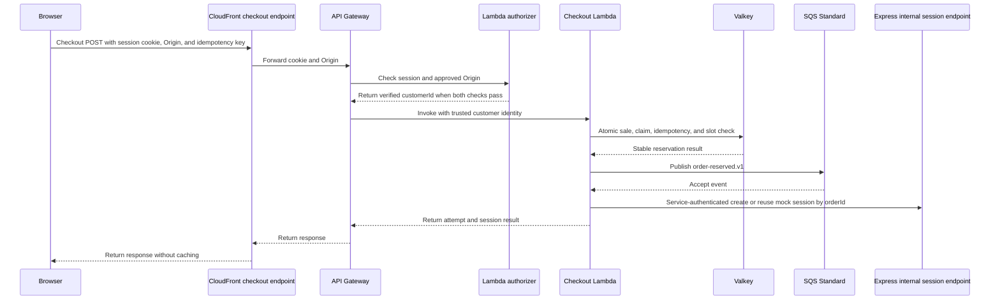

# Checkout

## Purpose

This document defines the purchase request path and the hot-path reservation rules.

## Flow

The browser sends the checkout POST directly to the configured CloudFront endpoint with its Better Auth session cookie and `Origin` header. CloudFront forwards both values to API Gateway. The Lambda authorizer validates the session with Better Auth semantics and checks the origin before API Gateway invokes checkout.

Express never invokes Lambda and never proxies the purchase request. After SQS accepts the reservation event, Lambda calls the internal Express mock-session endpoint with service authentication. Browsers cannot call that endpoint.

The Lambda generates the authoritative `orderId`, then reserves one Valkey slot and publishes `order-reserved.v1` to SQS Standard. It returns an accepted result only after SQS accepts the event and the mock session exists.

## Decisions & assumptions

- The request contains one client-generated `idempotencyKey`. It does not accept a quantity other than one.
- The logical idempotency key is `(listingId, trusted customerId, client idempotencyKey)`. Only the same customer and listing can reuse a binding.
- The API Gateway Lambda authorizer validates the Better Auth session and passes trusted `customerId` to Lambda. The Lambda ignores any browser-supplied `customerId`.
- For cookie-authenticated checkout POST requests, the authorizer requires an approved `Origin` value. It rejects a missing or unapproved origin before checkout runs.
- The approved origin allowlist contains exact storefront origins. Deployment configuration supplies its values; this design does not hard-code an origin.
- CORS and cookie `SameSite` settings do not replace the Origin check.
- The result includes `attemptId`, `orderId`, `reservationId`, `paymentSessionId`, `state`, and `idempotencyKey`.
- The same tuple reuses its reservation while Valkey retains the binding. It does not pop a second slot.
- A cancelled attempt remains bound to its original tuple. A new client key can start a new attempt for that customer and listing.
- The same client key under another customer or listing creates an independent binding. It cannot return another customer's order or session.
- Only a `COMPLETE` order enforces one purchase per customer and listing.
- A future checkout with DynamoDB must make its conditional write the atomic slot claim. Streams and EventBridge Pipes then carry committed claims to SQS.

## Gotchas

A Valkey pop before SQS publication creates a gap. A Lambda crash in that gap has no durable replay. A same-key retry is best effort while Valkey retains the reservation.

If SQS accepts an event but Lambda does not receive confirmation, a retry can publish a duplicate. The Express worker must process duplicates idempotently.

If Valkey state is missing or ownership is unclear, fail closed. Do not claim a durable replay path.

The deployed path does not define a local route, cookie name, or CloudFront path prefix. The selected identity design is in [Identity and access](identity-and-access.md).

CloudFront must forward the Better Auth session cookie and `Origin` header. It must not cache checkout responses. Cookie domain, `SameSite`, origin forwarding, and the approved-origin configuration need deployment checks.

See [API Gateway Lambda authorizer guidance](https://docs.aws.amazon.com/apigateway/latest/developerguide/http-api-lambda-authorizer.html) and [CloudFront origin request guidance](https://docs.aws.amazon.com/AmazonCloudFront/latest/DeveloperGuide/controlling-origin-requests.html).

## Change log

### 2026-09-23

- Defined the browser-to-CloudFront-to-API-Gateway-to-Lambda purchase path.
- Recorded same-key retry limits and the Valkey-to-SQS crash gap.
- Selected Better Auth session validation through an API Gateway Lambda authorizer.
