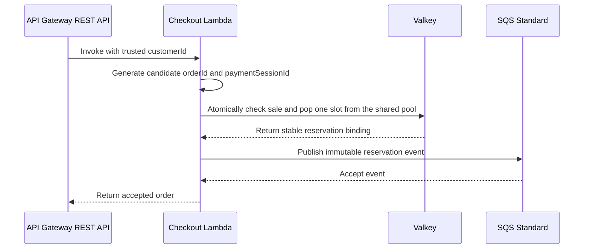
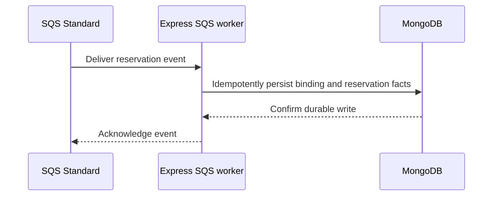

# Checkout

## Purpose

This document defines the purchase request path and the hot-path reservation rules.

## Flow

### Reserve and publish

### Persist reservation facts

The browser sends the checkout POST directly to the configured CloudFront endpoint with its Better Auth session cookie and `Origin` header. CloudFront forwards both values to the API Gateway REST API. The REQUEST Lambda authorizer checks `Origin` first. It rejects a missing or unapproved origin without calling Better Auth or reading Valkey. It checks the cookie and session only after the origin passes.

Serve auth and checkout under the same host, or keep the checkout hostname within the Better Auth cookie scope. If the storefront and checkout origins differ, the storefront request uses `credentials: 'include'`. The exact hostnames remain a deployment choice.

For different origins, configure credentialed CORS. Return the exact approved storefront origin in `Access-Control-Allow-Origin`, never `*`, and return `Access-Control-Allow-Credentials: true` on successful POST and relevant error responses. CloudFront must allow and forward `OPTIONS` and its preflight headers. The unauthenticated API Gateway `OPTIONS` method returns the exact origin and credentials headers, plus `Access-Control-Allow-Methods` and `Access-Control-Allow-Headers` for required values. It must not use the POST authorizer or invoke checkout. Same-origin checkout does not require a preflight.

Express never invokes Lambda and never proxies the purchase request. SQS is the only Lambda-to-Express bridge. Lambda creates candidate `orderId` and `paymentSessionId` values before the atomic Valkey claim, which stores them with the reservation. A same-key retry uses the stored values. Lambda sends their immutable binding with customer, listing, reservation, and slot facts in `order-reserved.v1`. The Express SQS worker writes these facts and the payment-session binding to MongoDB.

Lambda returns an accepted result only after SQS accepts `order-reserved.v1`. The mock page shows a pending state until the SQS worker persists the binding in MongoDB. It enables owner-checked outcome buttons only after Express confirms that binding.

Valkey contains all `stockTotal` physical slots in one claimable pool. Checkout rejects a request as sold out only when its atomic operation finds no claimable slot. At most `stockTotal` orders can reach `COMPLETE`. `reserveSlots` affects the advertised `publicStock` count, not the number or routing of slots in the Valkey pool. The storefront wording when public remaining reaches zero while the pool still has slots is an open choice.

## Decisions & assumptions

- The request contains one client-generated `idempotencyKey`. It does not accept a quantity other than one.
- Atomic Valkey pop assigns each slot to at most one concurrent request. The reserve count does not prevent duplicate claims.
- Checkout can claim any slot in the one pool. A cancellation returns one slot to that same pool through the existing guarded release.
- The logical idempotency key is `(listingId, trusted customerId, client idempotencyKey)`. Only the same customer and listing can reuse a binding.
- The API Gateway REQUEST Lambda authorizer checks `Origin` before it validates the Better Auth session. It passes trusted `customerId` to Lambda only when both checks pass. The Lambda ignores any browser-supplied `customerId`.
- Better Auth stores sessions in Valkey secondary storage. MongoDB stores users, credentials, and business data. The authorizer does not call Express or MongoDB.
- Keep `session.storeSessionInDatabase` unset or `false`. A missing Valkey session fails closed and requires a new login.
- The authorizer uses Better Auth `getSession` with `disableRefresh: true` and `disableCookieCache: true`. It does not refresh an active session. Better Auth may still delete an expired session and return an expiry cookie that the authorizer cannot forward. Normal Express auth responses handle active-session refresh.
- API Gateway authorizer-result caching is disabled, so checkout authorization reads current Valkey session state.
- For cookie-authenticated checkout POST requests, the authorizer requires an approved `Origin` value. It rejects a missing or unapproved origin before checkout runs.
- The approved origin allowlist contains exact storefront origins. Deployment configuration supplies its values; this design does not hard-code an origin.
- CORS and cookie `SameSite` settings do not replace the Origin check.
- The result includes `attemptId`, `orderId`, `reservationId`, `paymentSessionId`, `state`, and `idempotencyKey`.
- The SQS event contains immutable `orderId`, `customerId`, `listingId`, `reservationId`, `slotId`, and `paymentSessionId` binding fields.
- Lambda does not request Express. SQS is the only Lambda-to-Express bridge.
- The same tuple reuses its reservation while Valkey retains the binding. It does not pop a second slot.
- A cancelled attempt remains bound to its original tuple. A new client key can start a new attempt for that customer and listing.
- The same client key under another customer or listing creates an independent binding. It cannot return another customer's order or session.
- Only a `COMPLETE` order enforces one purchase per customer and listing.
- A future checkout with DynamoDB must make its conditional write the atomic slot claim. Streams and EventBridge Pipes then carry committed claims to SQS.

## Gotchas

A Valkey pop before SQS publication creates a gap. A Lambda crash in that gap has no durable replay. A same-key retry is best effort while Valkey retains the reservation.

If SQS accepts an event but Lambda does not receive confirmation, a retry can publish a duplicate. The Express worker must process duplicates idempotently.

If Valkey state is missing or ownership is unclear, fail closed. Do not claim a durable replay path.

The deployed path does not define a local route, cookie name, or CloudFront path prefix. The selected identity design is in [Identity and access](identity-and-access.md).

CloudFront must forward the Better Auth session cookie and `Origin` header. It must not cache checkout responses. Cookie scope, `SameSite`, origin forwarding, and the approved-origin configuration need deployment checks. Test exact-origin credentialed CORS on successful POST and relevant error responses, plus unauthenticated preflight when origins differ.

See [API Gateway REST Lambda authorizer guidance](https://docs.aws.amazon.com/apigateway/latest/developerguide/apigateway-use-lambda-authorizer.html), [CloudFront origin request guidance](https://docs.aws.amazon.com/AmazonCloudFront/latest/DeveloperGuide/controlling-origin-requests.html), and [Better Auth secondary storage guidance](https://better-auth.com/docs/concepts/database).

## Change log

### 2026-09-23

- Defined the browser-to-CloudFront-to-API-Gateway-to-Lambda purchase path.
- Recorded same-key retry limits and the Valkey-to-SQS crash gap.
- Selected Better Auth session validation through an API Gateway Lambda authorizer.
- Selected Valkey secondary storage for Better Auth sessions and REST REQUEST authorization.
- Added cookie-scope and conditional cross-origin CORS requirements.
- Required Origin rejection before Better Auth or Valkey access.
- Made SQS the only Lambda-to-Express bridge and added the immutable payment binding to the event.
- Made the mock page wait for the MongoDB binding before it enables owner-checked outcomes.
- Split reservation publication from SQS fact persistence and removed the preflight exchange.
- Defined the shared all-slot Valkey pool, sold-out check, and `stockTotal` completion limit.
