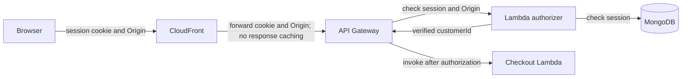

# Identity and access

## Purpose

This document defines trust boundaries and the selected checkout identity design.

## Flow

The browser sends its Better Auth session cookie and `Origin` header to the configured CloudFront checkout endpoint. CloudFront forwards both values to API Gateway.

The API Gateway Lambda authorizer validates the Better Auth session before API Gateway invokes the checkout Lambda. Validation follows Better Auth session semantics, including cookie integrity, expiry, and the MongoDB-backed session lookup. The authorizer passes trusted `customerId` to Lambda.

The authorizer is a separate Lambda handler. API Gateway invokes the checkout Lambda only after the authorizer returns the verified identity.

## Decisions & assumptions

- The selected checkout authorization mechanism is an API Gateway Lambda authorizer that validates the Better Auth session with Better Auth semantics.
- Disable authorizer-result caching in the initial design. A cached result can remain valid after session revocation. Revisit this choice only with a defined revocation target and cache duration.
- CloudFront forwards the Better Auth session cookie and does not cache checkout responses.
- For cookie-authenticated, state-changing checkout POST requests, the API Gateway Lambda authorizer requires an approved `Origin` value before it passes the trusted identity to checkout.
- The authorizer rejects a missing or unapproved `Origin`. Its allowlist contains exact storefront origins supplied by deployment configuration. This design does not hard-code origin values.
- Do not rely on CORS or cookie `SameSite` settings alone to prevent cross-site requests. The authorizer's Origin check is required.
- Option B, a short-lived signed checkout token validated by an API Gateway JWT authorizer, is deferred. Reconsider it only if a later design needs a separate checkout credential.
- The Lambda never trusts a browser-supplied `customerId`.
- Keep the authorizer as a separate Lambda handler. Its package placement is an implementation decision. Keep the repository at three packages.
- Public users can read sale status. Authenticated customers can attempt checkout and read only their own result. Administrators can create listings, load stock, verify seeds, and inspect recovery state.
- Better Auth uses email/password credentials and its MongoDB adapter. Express enforces customer and administrator roles for its routes.
- The provider-shaped payment callback requires service authentication. The browser can request a mock outcome only for its own order in local or test mode.
- The Lambda's internal mock-session endpoint also requires service authentication. It rejects browser requests. The exact service credential mechanism remains an implementation choice.

The selected design follows [API Gateway Lambda authorizer guidance](https://docs.aws.amazon.com/apigateway/latest/developerguide/http-api-lambda-authorizer.html), [CloudFront origin request guidance](https://docs.aws.amazon.com/AmazonCloudFront/latest/DeveloperGuide/controlling-origin-requests.html), and [Better Auth session guidance](https://better-auth.com/docs/concepts/session-management). The implementation must use Better Auth session semantics. It must not use a raw MongoDB token lookup as the only validation step.

## Gotchas

Do not invent a cookie name, local URL, authorization header, CloudFront path prefix, or approved storefront origin.

Verify the cookie domain and `SameSite` settings, CloudFront forwarding for the cookie and `Origin` header, and the exact-origin allowlist during deployment. This design does not claim that these settings exist yet.

Payment metadata does not authorize access. Express checks callback data against the immutable server-side session binding.

Do not expose the internal mock-session endpoint to browsers. Do not treat `customerId` or payment-session metadata from a browser as trusted session-binding data.

The browser does not call Valkey, SQS, MongoDB, the checkout Lambda, or the provider-shaped callback route directly. The CloudFront checkout endpoint is the browser's purchase boundary.

## Change log

### 2026-09-23

- Selected a Better Auth session-checking API Gateway Lambda authorizer.
- Deferred the signed checkout token option.
- Defined identity and payment callback trust boundaries.
