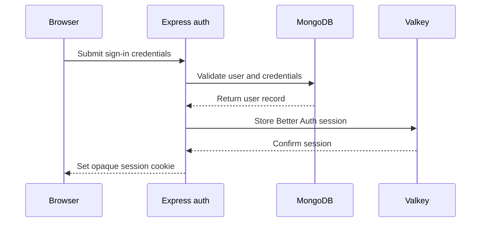
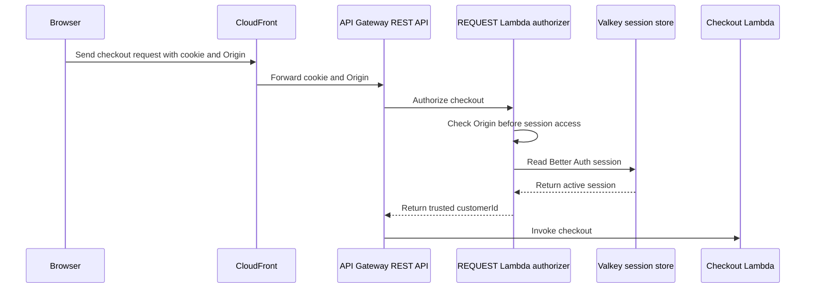

# Identity and access

## Purpose

This document defines the current sign-up and login flow and the planned checkout identity design.

## Flow

### Sign-in session

### Checkout authorization

The browser sends its Better Auth session cookie and `Origin` header to the configured CloudFront checkout endpoint. CloudFront forwards both values to API Gateway.

The storefront sends email/password requests to Express at `/api/auth/*`. Express passes each raw request to Better Auth before JSON parsing. Better Auth stores users and credentials in MongoDB. It stores sessions in Valkey secondary storage with the `bookipi:auth:` prefix. The sign-up page submits a name, email, and password. Better Auth uses its default password policy and auto-signs in after successful sign-up. The login page submits an email and password. Both pages can read the current session and sign out.

The REST API REQUEST Lambda authorizer checks `Origin` first. It rejects a missing or unapproved origin without calling Better Auth or reading Valkey. After the origin passes, it checks the opaque Better Auth cookie with the same Better Auth secret. It reads the session from Valkey secondary storage and applies Better Auth cookie integrity and expiry rules. It passes only the active `customerId` to checkout. Checkout does not use the stored role snapshot.

Better Auth uses MongoDB for users, accounts, and credentials. It uses Valkey secondary storage for sessions. Keep `session.storeSessionInDatabase` unset or `false`. Better Auth must not fall back to MongoDB when a session is absent from Valkey. A missing or expired Valkey session requires a new login.

The authorizer does not call Express or MongoDB. Normal Express auth responses handle active-session refresh. Keep auth and inventory key namespaces separate in Valkey. A Valkey error or missing session denies checkout. Do not fall back to MongoDB.

Serve auth and checkout under the same host, or keep the checkout hostname within the Better Auth cookie scope. If the storefront and checkout origins differ, the storefront request uses `credentials: 'include'`. The exact hostnames remain a deployment choice.

If the storefront and checkout origins differ, configure credentialed CORS. Return the exact approved storefront origin in `Access-Control-Allow-Origin`, never `*`, and return `Access-Control-Allow-Credentials: true` on successful POST and relevant error responses. CloudFront must allow and forward `OPTIONS` and its preflight headers. The unauthenticated API Gateway `OPTIONS` method returns the exact origin and credentials headers, plus `Access-Control-Allow-Methods` and `Access-Control-Allow-Headers` for required values. It must not use the checkout POST authorizer or invoke checkout. Same-origin checkout does not require a preflight.

The authorizer is a separate Lambda handler. API Gateway invokes the checkout Lambda only after the authorizer returns the verified identity.

## Decisions & assumptions

- The selected checkout authorization mechanism is an API Gateway REST REQUEST Lambda authorizer. It reads Better Auth sessions from Valkey secondary storage.
- Disable API Gateway authorizer-result caching. Each checkout authorization reads current Valkey session state, so logout and revocation take effect on the next request.
- Use Better Auth `getSession` with `disableRefresh: true` and `disableCookieCache: true` in the authorizer. This prevents active-session refresh. Better Auth can still delete an expired session and return an expiry cookie that the authorizer cannot forward.
- Serve auth and checkout under the same host, or keep the checkout hostname within the Better Auth cookie scope. If origins differ, use `credentials: 'include'` and configure credentialed CORS.
- Configure a separate unauthenticated `OPTIONS` method for cross-origin preflight. It must not use the checkout POST authorizer or invoke checkout.
- CloudFront forwards the Better Auth session cookie and does not cache checkout responses.
- For cookie-authenticated, state-changing checkout POST requests, the API Gateway Lambda authorizer requires an approved `Origin` value before it passes the trusted identity to checkout.
- The authorizer rejects a missing or unapproved `Origin`. Its allowlist contains exact storefront origins supplied by deployment configuration. This design does not hard-code origin values.
- Do not rely on CORS or cookie `SameSite` settings alone to prevent cross-site requests. The authorizer's Origin check is required.
- Keep the Better Auth cookie opaque. Do not add a JWT or a second checkout token.
- The Lambda never trusts a browser-supplied `customerId`.
- Keep the authorizer in the separate `packages/checkout-authorizer` package. It does not belong in the backend or checkout processor.
- Public users can read sale status. Authenticated customers can attempt checkout and read only their own result. Administrators can create listings, load stock, verify seeds, and inspect recovery state.
- Better Auth uses email/password credentials and its MongoDB adapter for users and credentials. Valkey secondary storage holds sessions and a user snapshot.
- The backend requires `BETTER_AUTH_URL`, `BETTER_AUTH_SECRET`, `MONGODB_URI`, `MONGODB_DATABASE`, and `VALKEY_URL` at startup. `STOREFRONT_ORIGIN` adds one exact trusted origin when set.
- Better Auth sets `session.storeSessionInDatabase` to `false`. An absent Valkey session has no MongoDB fallback.
- The storefront client sends credentials and reads `NEXT_PUBLIC_API_BASE_URL` at build time.
- Checkout uses only the active `customerId`. Privileged Express routes must read current roles from MongoDB or invalidate affected sessions after a role change.
- Valkey loss removes active session state as well as inventory state. Customers must sign in again after session state is lost. The design does not claim durable session storage.
- The provider-shaped payment callback requires service authentication. The browser can request a mock outcome only for its own order in local or test mode.
- SQS is the only Lambda-to-Express bridge. The SQS worker persists the immutable payment-session binding.

The selected design follows [API Gateway REST Lambda authorizer guidance](https://docs.aws.amazon.com/apigateway/latest/developerguide/apigateway-use-lambda-authorizer.html), [API Gateway REST CORS guidance](https://docs.aws.amazon.com/apigateway/latest/developerguide/how-to-cors.html), [CloudFront origin request guidance](https://docs.aws.amazon.com/AmazonCloudFront/latest/DeveloperGuide/controlling-origin-requests.html), [Better Auth session guidance](https://better-auth.com/docs/concepts/session-management), and [Better Auth secondary storage guidance](https://better-auth.com/docs/concepts/database). The authorizer must use Better Auth session semantics. It must not parse a cookie or query Valkey with a custom session format.

## Gotchas

Do not invent a cookie name, local URL, authorization header, CloudFront path prefix, or approved storefront origin.

Verify cookie scope, `SameSite` settings, CloudFront forwarding, the exact-origin allowlist, and REST REQUEST authorizer behavior in the deployed path. If origins differ, test exact-origin credentialed CORS on POST and error responses, plus unauthenticated preflight. LocalStack tests do not prove CloudFront forwarding or deployed authorizer behavior.

If Valkey is unavailable, the authorizer denies checkout. It does not query MongoDB. A full Valkey loss requires customers to sign in again after service recovery.

Payment metadata does not authorize access. Express checks callback data against the immutable server-side session binding.

The SQS event carries the payment-session binding to Express. Do not treat `customerId` or payment-session metadata from a browser as trusted session-binding data.

The browser does not call Valkey, SQS, MongoDB, the checkout Lambda, or the provider-shaped callback route directly. The CloudFront checkout endpoint is the browser's purchase boundary.

## Change log

### 2026-09-23

- Selected a Better Auth session-checking API Gateway Lambda authorizer.
- Kept the Better Auth cookie opaque and deferred a separate checkout token.
- Defined identity and payment callback trust boundaries.
- Moved Better Auth sessions to Valkey secondary storage and kept users and credentials in MongoDB.
- Selected an API Gateway REST REQUEST authorizer with no result caching or MongoDB fallback.
- Limited checkout identity to `customerId` and defined role-change handling for privileged Express routes.
- Defined active-session refresh and expired-session cleanup behavior for the authorizer.
- Added cookie-scope and conditional cross-origin CORS requirements.
- Required Origin rejection before Better Auth or Valkey access.
- Added a sequence diagram that shows the Valkey session read and the separate MongoDB user and credential store.
- Split sign-in session creation from checkout authorization.
- Placed the authorizer in a dedicated package outside the backend and checkout processor.
- Implemented the email/password sign-up and login slice of Increment 2. Listing setup remains pending.
