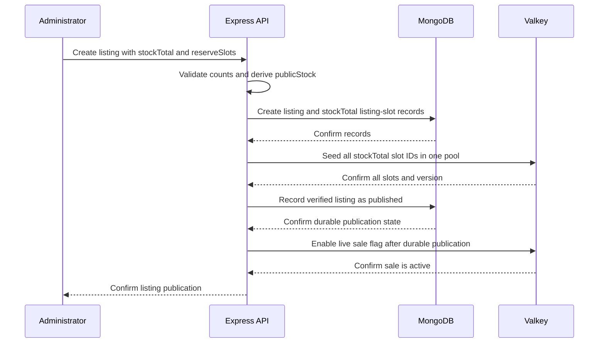
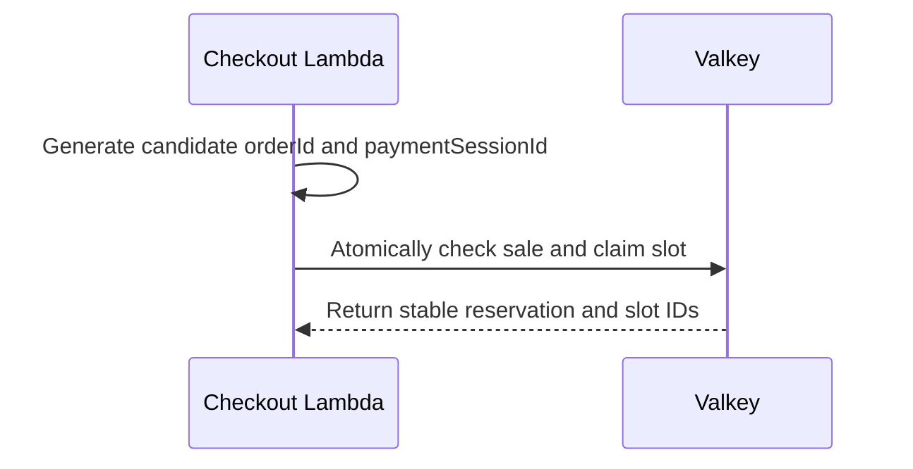

# Listing and inventory

## Purpose

This document defines listing publication and the inventory authority during a sale.

## Flow

### Listing publication

### Slot claim

`stockTotal` is the true physical slot count. `reserveSlots` is a configurable subset of that total. `publicStock = stockTotal - reserveSlots` is the advertised count. For example, `stockTotal: 15` with `reserveSlots: 5` gives `publicStock: 10`; `stockTotal: 10` with `reserveSlots: 2` gives `publicStock: 8`. In both cases, the reserve is part of the physical total, not an extra pool.

The listing requires integer counts, `stockTotal > 0`, and `0 <= reserveSlots <= stockTotal`. Express creates the listing and one durable `listing-slot` record for each of the `stockTotal` slots in MongoDB.

Express seeds one Valkey availability list with all `stockTotal` slot IDs and checks the seed before it publishes the listing. A failed or incomplete seed leaves the listing unavailable. All slots in this one pool are claimable. Atomic Valkey pop prevents two concurrent requests from claiming the same slot; the reserve does not provide this protection.

The checkout Lambda reads the published sale state in Valkey. It uses one atomic Valkey operation to check the sale state, customer claim, scoped idempotency binding, and available slots. It reserves one slot from the shared pool. The sale is sold out only when Valkey has no claimable slots. The storefront wording when public remaining reaches zero before that point remains an open choice.

The logical idempotency key is `(listingId, trusted customerId, client idempotencyKey)`. The customer ID comes from the API Gateway authorizer. A client key from another customer or listing resolves to a separate binding and cannot return the first order or payment session.

MongoDB records listing and slot facts. Valkey is the live inventory authority during the sale. SQS carries reservation facts to MongoDB.

The Lambda generates candidate `orderId` and `paymentSessionId` values before the atomic Valkey claim. The claim stores them with the reservation. A same-key retry reuses the stored IDs. The SQS event carries immutable `orderId`, `customerId`, `listingId`, `reservationId`, `slotId`, and `paymentSessionId` fields. Lambda does not call Express. The Express worker persists the binding before the mock payment page can enable owner-checked outcome buttons.

## Decisions & assumptions

- The initial sale has one listing and one product.
- Each purchase has quantity one.
- Valkey keys use the listing ID as a namespace:

  | Key | Type | Purpose |
  | --- | --- | --- |
  | `sale:{listingId}:meta` | hash | Sale window, publication state, seed version, `stockTotal`, `reserveSlots`, and derived `publicStock`. |
  | `sale:{listingId}:available-slots` | list | Available slot identifiers. |
  | `sale:{listingId}:user-claims` | hash | Customer ID to reservation ID mapping. |
  | `sale:{listingId}:idempotency` | hash | Customer ID and client idempotency key to stable attempt and order data within the listing. |
  | `sale:{listingId}:reservation:{reservationId}` | hash | Order, customer, slot, state, event, and session data. |
  | `sale:{listingId}:reservation:{reservationId}:release` | hash | Guarded release marker. |

- MongoDB `listing-slots` has a unique `{ listingId: 1, slotId: 1 }` index and a `{ listingId: 1, state: 1 }` lookup index.
- A completed order retains the customer claim. A cancellation releases that claim only when it still points to the old reservation.
- A cancellation returns one slot to the same pool only after the guarded release matches the old reservation.
- At most `stockTotal` orders can reach `COMPLETE`, even when more customers can claim slots than `publicStock` advertises.
- Every idempotency lookup uses the listing and trusted customer identity as well as the client key. The atomic operation never returns another customer's binding.
- The MongoDB slot record moves from `available` to `reserved` after the SQS worker persists facts. It moves to `secured` when a `COMPLETE` transaction assigns `orderId`.
- A future DynamoDB design must make DynamoDB the atomic slot-claim owner. DynamoDB Streams can then feed EventBridge Pipes, which sends events to SQS. This design does not use DynamoDB or Pipes.

## Gotchas

Express does not reserve a slot. The purchase path calls the CloudFront checkout endpoint, which routes through API Gateway to Lambda.

If Valkey seeding or verification fails, Express does not publish the listing.

After full Valkey state loss, MongoDB may not prove which slots were popped before SQS accepted an event. Keep checkout closed when ownership is unclear.

## Change log

### 2026-09-23

- Moved listing publication, inventory ownership, and the future DynamoDB alternative into this facet.
- Added a sequence diagram for listing seed, atomic reservation, and SQS-backed durable binding.
- Split listing publication from the atomic slot claim.
- Show durable publication state before the Valkey sale flag is enabled.
- Defined listing counts and seeded every physical slot in one claimable Valkey pool.
