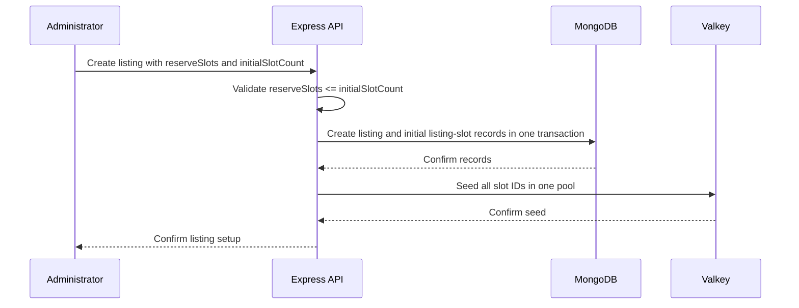
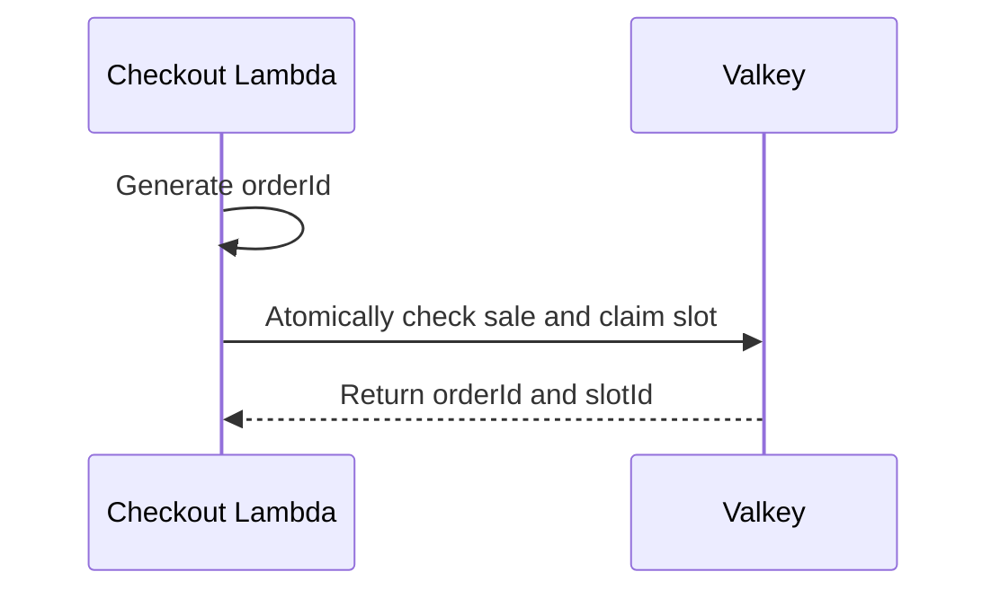

# Listing and inventory

## Purpose

This document defines listing setup and the inventory authority during a sale.

## Flow

### Listing setup

### Slot claim

The listing document stores its identifier, product display name, sale window, and `reserveSlots`. It does not store a stock total. The initial slot count is an operation parameter. MongoDB derives `stockTotal` by counting listing-slot documents. The system derives `publicStock = stockTotal - reserveSlots`.

The public `GET /api/listings/{listingId}` route returns the listing ID, product name, ISO sale times, `stockTotal`, `reserveSlots`, and `publicStock`. It returns `404` for an unknown listing. It does not expose slot IDs. The storefront displays `publicStock` as listing information. It does not use that value as live stock or as the sold-out rule.

The create operation requires a positive integer `initialSlotCount` and `0 <= reserveSlots <= initialSlotCount`. Express creates the listing and its initial slots in one MongoDB transaction.

The add-slots operation requires a positive integer count. It writes the listing timestamp inside a transaction, counts current slot documents, and inserts only the next sequential IDs. Concurrent additions serialize through the listing write. The unique `{ listingId: 1, slotId: 1 }` index rejects duplicate IDs.

For example, 15 slots with `reserveSlots: 5` gives `publicStock: 10`. Ten slots with `reserveSlots: 2` gives `publicStock: 8`. These counts come from slot documents. The reserve is a subset of the physical slots.

Express seeds one Valkey availability list with all slot IDs and checks the seed before it publishes the listing. A failed or incomplete seed leaves the listing unavailable. All slots in this pool are claimable. Atomic Valkey pop prevents two requests from claiming the same slot.

`src/features/listing/feature.ts` owns this seed and the guarded release scripts. It stores sale times as epoch milliseconds for the checkout processor. It refuses to replace existing inventory. The cancellation release checks ownership and a release marker in one Valkey script. A matching marker returns success on retry. A marker or owner mismatch returns failure. The Express worker calls it only with facts from a durable cancelled order. The demo data in `src/features/seed/feature.ts` calls `createListing` and publishes through the same path.

The checkout Lambda reads the published sale state in Valkey. It uses one atomic operation to check the sale state, customer claim, scoped idempotency binding, and available slots. The sale is sold out only when Valkey has no claimable slots.

The logical idempotency key is `(listingId, trusted customerId, client idempotencyKey)`. The customer ID comes from the API Gateway authorizer. A client key from another customer or listing resolves to a separate checkout attempt.

Listing IDs use 1 to 128 ASCII letters, digits, underscores, or hyphens. The first character is a letter or digit. This contract keeps the listing ID inside its Valkey `{listingId}` hash tag.

MongoDB records listing and slot facts. Valkey is the live inventory authority during the sale. SQS carries `orderId`, `customerId`, `listingId`, and `slotId` to MongoDB. The worker persists the order before the mock payment page acts on `orderId`.

## Decisions & assumptions

- The initial sale has one listing and one product.
- Each purchase has quantity one.
- Valkey keys use the listing ID as a namespace:

  | Key                                        | Type | Purpose                                                           |
  | ------------------------------------------ | ---- | ----------------------------------------------------------------- |
  | `sale:{listingId}:meta`                    | hash | Sale window, publication state, seed version, and `reserveSlots`. |
  | `sale:{listingId}:available-slots`         | list | Available slot identifiers.                                       |
  | `sale:{listingId}:idempotency`             | hash | Encoded customer and client key fields map to `orderId`.          |
  | `sale:{listingId}:active-customers`        | hash | Encoded customer fields map to the active `orderId`.              |
  | `sale:{listingId}:orders`                  | hash | Order facts stored in fields named `{orderId}:<fact>`.            |
  | `sale:{listingId}:order:{orderId}:release` | hash | Explicit guarded release marker.                                  |

The claim script passes the five listing keys through `KEYS`. It stores tuple and order values in hash fields. It does not create Redis key names inside Lua. The release script also passes its release marker through `KEYS`.

- MongoDB `listing-slots` has a unique `{ listingId: 1, slotId: 1 }` index and a `{ listingId: 1, state: 1 }` lookup index.
- A completed order retains its field in `active-customers`. A cancellation clears that field only when it still points to the old `orderId`.
- A cancellation returns one slot to the same pool only after the guarded release matches the old `orderId`.
- The number of completed orders cannot exceed the number of slot documents.
- Every idempotency lookup uses the tuple field built from the listing, trusted customer identity, and client key.
- URI encoding keeps customer IDs and client keys from changing the listing hash tag.
- Listing IDs use the same restricted contract in Express and checkout.
- The MongoDB slot record uses `orderId` as its owner after the SQS worker persists the order.
- A future DynamoDB design must make DynamoDB the atomic slot-claim owner. DynamoDB Streams can then feed EventBridge Pipes, which sends events to SQS. This design does not use DynamoDB or Pipes.

## Gotchas

Express does not reserve a slot. The purchase path calls the CloudFront checkout endpoint, which routes through API Gateway to Lambda.

If Valkey seeding or verification fails, Express does not publish the listing.

The guarded release method checks the exact `orderId`, listing ID, and slot ID. It adds a slot once. A future worker must verify durable cancellation before it calls the method.

After full Valkey state loss, MongoDB may not prove which slots were popped before SQS accepted an event. Keep checkout closed when ownership is unclear.

## Change log

### 2026-09-24

- Added verified Valkey publication, the processor slot claim, and guarded listing release methods.
- Defined safe listing IDs and the active-customer and per-tuple idempotency keys.
- Mapped tuple, customer, and order state to listing-scoped Valkey hashes.
- Made matching release markers idempotent for worker crash recovery.

### 2026-09-23

- Defined listing inventory counts from durable slot documents.
- Added transactional listing setup and sequential slot growth.
- Kept Valkey as the live inventory authority and SQS as the Lambda-to-Express bridge.
