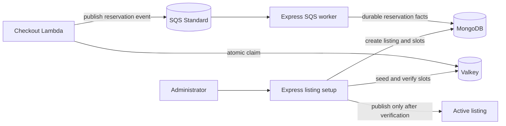

# Listing and inventory

## Purpose

This document defines listing publication and the inventory authority during a sale.

## Flow

Express creates the listing and one durable `listing-slot` record per stock unit in MongoDB.

Express seeds the Valkey availability list and checks the seed before it publishes the listing. A failed or incomplete seed leaves the listing unavailable.

The checkout Lambda uses one atomic Valkey operation to check the sale state, customer claim, scoped idempotency binding, and available slots. It reserves one slot.

The logical idempotency key is `(listingId, trusted customerId, client idempotencyKey)`. The customer ID comes from the API Gateway authorizer. A client key from another customer or listing resolves to a separate binding and cannot return the first order or payment session.

MongoDB records listing and slot facts. Valkey is the live inventory authority during the sale. SQS carries reservation facts to MongoDB.

## Decisions & assumptions

- The initial sale has one listing and one product.
- Each purchase has quantity one.
- Valkey keys use the listing ID as a namespace:

  | Key | Type | Purpose |
  | --- | --- | --- |
  | `sale:{listingId}:meta` | hash | Sale window, publication state, seed version, and stock total. |
  | `sale:{listingId}:available-slots` | list | Available slot identifiers. |
  | `sale:{listingId}:user-claims` | hash | Customer ID to reservation ID mapping. |
  | `sale:{listingId}:idempotency` | hash | Customer ID and client idempotency key to stable attempt and order data within the listing. |
  | `sale:{listingId}:reservation:{reservationId}` | hash | Order, customer, slot, state, event, and session data. |
  | `sale:{listingId}:reservation:{reservationId}:release` | hash | Guarded release marker. |

- MongoDB `listing-slots` has a unique `{ listingId: 1, slotId: 1 }` index and a `{ listingId: 1, state: 1 }` lookup index.
- A completed order retains the customer claim. A cancellation releases that claim only when it still points to the old reservation.
- Every idempotency lookup uses the listing and trusted customer identity as well as the client key. The atomic operation never returns another customer's binding.
- The MongoDB slot record moves from `available` to `reserved` after the SQS worker persists facts. It moves to `secured` when a `COMPLETE` transaction assigns `orderId`.
- A future DynamoDB design must make DynamoDB the atomic slot-claim owner. DynamoDB Streams can then feed EventBridge Pipes, which sends events to SQS. This design does not use DynamoDB or Pipes.

## Gotchas

Express does not reserve a slot. The purchase path calls the CloudFront checkout endpoint, which routes through API Gateway to Lambda.

If Valkey seeding or verification fails, Express does not publish the listing.

After full Valkey state loss, MongoDB may not prove which slots were popped before SQS accepted an event. Keep checkout closed when ownership is unclear.

## Change log

### 2026-09-23

- Moved listing publication, inventory ownership, and the future DynamoDB alternative into this facet.
