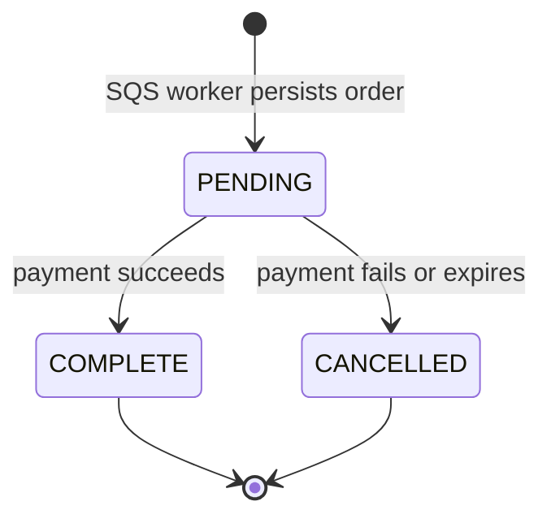

# Orders

## Purpose

This document defines the durable order record and ownership indexes.

## Flow

The order stores `orderId`, `customerId`, `listingId`, `slotId`, `status`, and timestamps. The SQS worker writes the order fields. The mock payment page acts on `orderId` after the worker persists the order.

`orderId` is the checkout-attempt and slot-owner identifier. The order model does not store payment facts or a second reservation identifier.

## Decisions & assumptions

- Every order has a unique `orderId`.
- The model defines `PENDING`, `COMPLETE`, and `CANCELLED` statuses.
- A unique partial `{ listingId: 1, customerId: 1 }` index covers `PENDING` and `COMPLETE` orders. Its filter requires both indexed fields to exist.
- A unique partial `{ listingId: 1, slotId: 1 }` index covers `PENDING` and `COMPLETE` orders. Its filter requires both indexed fields to exist.
- The active indexes exclude `CANCELLED` so a later checkout can use the same listing and slot.
- `orderId` is the only order and slot-owner identifier.
- The client-generated idempotency key stays in Valkey. MongoDB stores no idempotency key, and duplicate SQS delivery upserts by `orderId`.
- Order transitions, payment callbacks, and release reconciliation remain planned work.

## Gotchas

The SQS worker acknowledges a message only after MongoDB persistence succeeds.

The order record does not make SQS a durable order store. SQS is transport, and MongoDB is the durable record.

## Change log

### 2026-09-23

- Simplified order storage to order identity, owner, listing, slot, status, and timestamps.
- Added active customer/listing and listing/slot ownership indexes.
