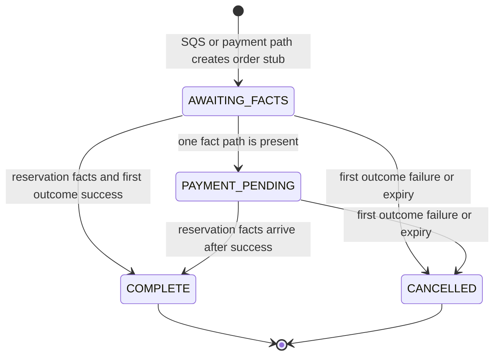

# Orders

## Purpose

This document defines durable order facts, field ownership, and legal state changes.

## Flow

The Express SQS worker owns reservation facts, customer, listing, slot, and price snapshot fields. The payment callback owns payment facts and the first valid payment outcome.

One reconciliation function combines stored facts. It accepts either event order and does not scan Valkey or republish SQS events.

## Decisions & assumptions

- MongoDB stores durable order facts and completed sales. Every order has a unique `orderId`.
- Payment-first stubs may lack SQS-owned fields until the queue event arrives.
- Planned unique partial indexes include `{ eventId: 1 }`, `{ reservationId: 1 }`, and `{ listingId: 1, customerId: 1 }` for active states. Filters require indexed fields to exist.
- The customer index covers `AWAITING_FACTS`, `PAYMENT_PENDING`, and `COMPLETE`. It excludes `CANCELLED` so a later checkout can start.
- The first valid provider outcome is immutable. A later conflicting event is recorded and ignored.
- `COMPLETE` and `CANCELLED` are terminal for the original order.
- Payment success before reservation facts keeps the order `PAYMENT_PENDING`. SQS facts then complete it.
- Failure or expiry may cancel an order before the SQS event. A delayed event can add facts but cannot reopen the order or claim the slot.
- The release worker clears `listing-slots` ownership only when `currentReservationId` matches the old reservation and `orderId` matches the old order or is unset. It does this before the Valkey release.
- An unowned durable slot can proceed to the guarded Valkey release. A newer owner or a secured/completed slot is not cleared or released.
- If the conditional clear does not match, the worker re-reads ownership before it decides to skip or continue.
- Completion uses one MongoDB transaction for the order transition and `listing-slots.orderId` assignment. Local MongoDB integration work requires a replica set.

## Gotchas

The SQS worker acknowledges a message only after MongoDB persistence succeeds.

The worker sets a durable slot owner only when the order is not cancelled and the slot is unowned or already belongs to the same reservation.

The order record does not make SQS a durable order store. SQS is transport, and MongoDB is the durable record.

## Change log

### 2026-09-23

- Moved order field ownership, indexes, and state rules into this facet.
