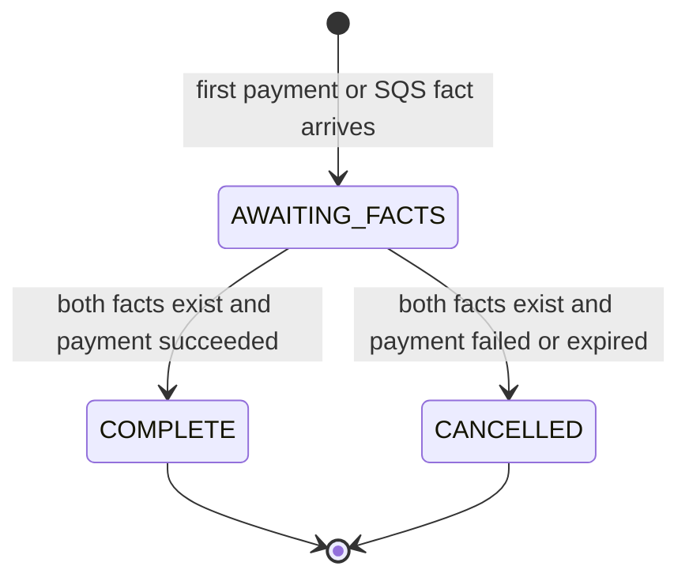

# Orders

## Purpose

This document defines durable order facts, field ownership, and legal state changes.

## Flow

The Express SQS worker owns reservation facts, customer, listing, slot, and price snapshot fields. The payment callback owns payment facts and the first valid payment outcome.

One reconciliation function combines stored facts. It accepts either event order and does not scan Valkey or republish SQS events.

The order stays `AWAITING_FACTS` until MongoDB has both the payment result and the SQS reservation facts. A provider callback may contain `orderId` and `paymentSessionId`, but may omit `reservationId` or `slotId`. Release never relies on webhook slot fields. Trusted slot ownership comes from the SQS event. A payment-first failure cannot release inventory. The slot stays held until SQS supplies and validates the binding.

`stockTotal` is the true number of physical slots for the listing. At most `stockTotal` orders can reach `COMPLETE`. The `reserveSlots` subset changes the advertised `publicStock` count only; it does not add slots beyond `stockTotal`.

## Decisions & assumptions

- MongoDB stores durable order facts and completed sales. Every order has a unique `orderId`.
- Payment-first stubs may lack SQS-owned fields until the queue event arrives. The SQS event contains immutable `orderId`, `customerId`, `listingId`, `reservationId`, `slotId`, and `paymentSessionId` fields.
- Planned unique partial indexes include `{ eventId: 1 }`, `{ reservationId: 1 }`, and `{ listingId: 1, customerId: 1 }` for active states. Filters require indexed fields to exist.
- The customer index covers `AWAITING_FACTS` and `COMPLETE`. It excludes `CANCELLED` so a later checkout can start.
- The first valid provider outcome is immutable after its `orderId` and `paymentSessionId` match the SQS binding. A mismatch is quarantined.
- MongoDB atomically assigns a per-order `receiveSequence` when it stores a new authenticated provider event. Callback insertion, SQS binding persistence, reconciliation, and terminal transitions serialize through the same per-order record. Each terminal transition selects the lowest-sequence committed event that matches the SQS binding. It ignores provider-supplied timestamps.
- A callback that commits after SQS binding persistence but before pending-event reconciliation participates in reconciliation. A callback insert that races with terminalization serializes through the per-order record, and a retry checks committed events by sequence.
- `COMPLETE` and `CANCELLED` are terminal for the original order.
- A payment result alone does not change `AWAITING_FACTS`. Reconciliation sets a terminal state only after both payment and reservation facts exist.
- Failure or expiry before the SQS event keeps the order `AWAITING_FACTS` and the Valkey slot held. After SQS supplies a matching binding, reconciliation sets `CANCELLED` and creates a pending release intent.
- The release worker clears `listing-slots` ownership only when `currentReservationId` matches the old reservation and `orderId` matches the old order or is unset. It records this operation's owner clear before the Valkey release.
- A failed conditional clear never permits release based only on the SQS binding. A retry can continue only when MongoDB records this operation's owner clear and no newer owner exists. A newer, secured, or unknown owner stays pending for manual reconciliation.
- MongoDB assigns a fresh release intent `releaseAttemptStarted=false`. The worker initializes a Valkey `not_applied` marker before its first release call and records `releaseAttemptStarted=true` before that call.
- The release worker checks the Valkey operation marker before it changes slot ownership. An applied marker completes the old intent without touching a newer owner. A missing marker after an attempt, or an expired or unavailable marker, is unknown and leaves the intent pending for manual reconciliation.
- Only a positively known `not_applied` marker allows the MongoDB owner guard. A newer or secured owner leaves the intent pending for manual reconciliation.
- A Valkey stale-owner result also leaves the intent pending for manual reconciliation.
- If the conditional clear does not match, the worker re-reads ownership and continues only when MongoDB records this operation's owner clear and no newer owner exists.
- Completion uses one MongoDB transaction for the order transition and `listing-slots.orderId` assignment. Local MongoDB integration work requires a replica set.
- The completed order count for a listing cannot exceed its `stockTotal` physical slots.

## Gotchas

The SQS worker acknowledges a message only after MongoDB persistence succeeds.

The worker sets a durable slot owner only when the order is not cancelled and the slot is unowned or already belongs to the same reservation.

The order record does not make SQS a durable order store. SQS is transport, and MongoDB is the durable record.

## Change log

### 2026-09-23

- Moved order field ownership, indexes, and state rules into this facet.
- Kept orders in `AWAITING_FACTS` until payment and SQS reservation facts both exist.
- Required validated SQS slot ownership before cancellation can create a release intent.
- Serialized payment event selection by per-order receive sequence and tightened owner-clear retries.
- Recorded the physical slot limit for completed orders and the role of the configured reserve count.
