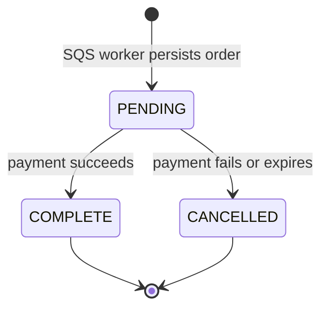

# Orders

## Purpose

This document defines the durable order record and ownership indexes.

## Flow

The order stores `orderId`, `customerId`, `listingId`, `slotId`, `status`, and timestamps. The SQS worker validates `order-reserved.v1` and inserts its immutable facts with status `PENDING`. `GET /api/orders/{orderId}` returns the order only to its authenticated owner. It returns `404` for an absent or non-owned order. The mock payment page acts on `orderId` after the worker persists the order.

In local or test mode, the payment feature handles `POST /api/orders/{orderId}/mock-outcome`. It changes only a `PENDING` order. Success sets `COMPLETE`. Failure or expiry sets `CANCELLED`. The same outcome can be retried. A different terminal result returns `409`. This transition does not release a slot.

The worker uses `$setOnInsert` by `orderId`. A replay cannot change an existing customer, listing, slot, status, or timestamp. If an event has different facts for the same order, the worker fails processing and leaves the message unacknowledged. A delayed event cannot reopen a `COMPLETE` or `CANCELLED` order.

`orderId` is the checkout-attempt and slot-owner identifier. The order model does not store payment facts or a second reservation identifier.

## Decisions & assumptions

- Every order has a unique `orderId`.
- The model defines `PENDING`, `COMPLETE`, and `CANCELLED` statuses.
- A unique partial `{ listingId: 1, customerId: 1 }` index covers `PENDING` and `COMPLETE` orders. Its filter requires both indexed fields to exist.
- A unique partial `{ listingId: 1, slotId: 1 }` index covers `PENDING` and `COMPLETE` orders. Its filter requires both indexed fields to exist.
- The active indexes exclude `CANCELLED` so a later checkout can use the same listing and slot.
- `orderId` is the only order and slot-owner identifier.
- The client-generated idempotency key stays in Valkey. MongoDB stores no idempotency key, and duplicate SQS delivery upserts by `orderId`.
- The unique `orderId` index provides idempotent order creation. Conflicting immutable facts fail closed.
- The mock outcome route requires `MOCK_PAYMENT_ENABLED=true` and `NODE_ENV=development` or `NODE_ENV=test`. It returns `404` when disabled.
- The payment feature owns mock outcome transitions. The order feature owns reservation facts and the order model.
- Provider callbacks, payment reconciliation, and release reconciliation remain planned work.

## Gotchas

The SQS worker acknowledges a message only after MongoDB persistence succeeds.

The order record does not make SQS a durable order store. SQS is transport, and MongoDB is the durable record.

The queue deployment must set a dead-letter policy for messages that keep failing. This increment does not define queue visibility or retry values.

## Change log

### 2026-09-23

- Simplified order storage to order identity, owner, listing, slot, status, and timestamps.
- Added active customer/listing and listing/slot ownership indexes.

### 2026-09-24

- Added idempotent persistence for immutable reservation facts from SQS.
- Added authenticated reads and atomic payment outcome transitions. Provider reconciliation and slot release remain pending.
