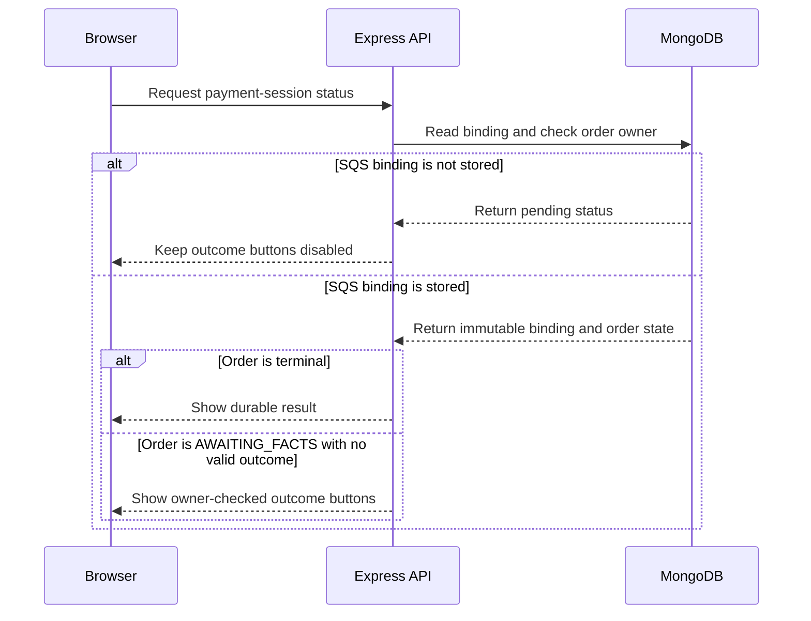
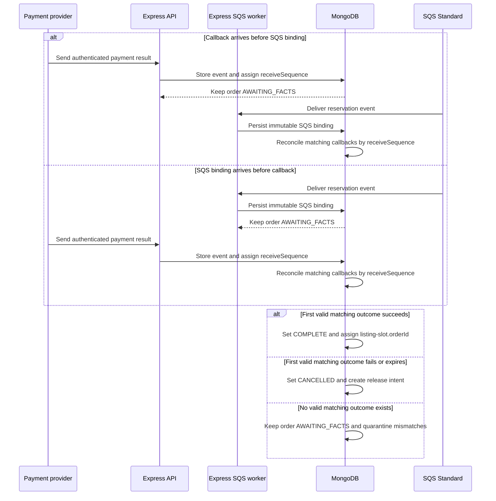
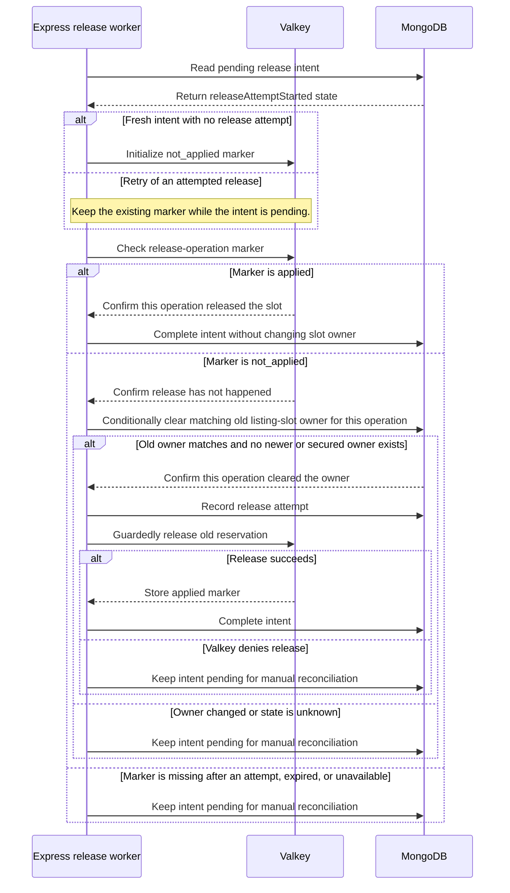

# Payments

## Purpose

This document defines the mock payment-session binding and callback behavior.

## Flow

### Mock page readiness

### Payment facts in either order

### Slot reallocation after order cancellation

Reallocation returns the cancelled order's slot to the same Valkey pool. It does not assign the slot to another customer. A later checkout can claim it only after the guarded release succeeds.

Lambda generates candidate `orderId` and `paymentSessionId` values before the atomic Valkey claim. The claim stores them with the reservation. A same-key retry uses the stored values. Lambda sends their immutable binding with customer, listing, reservation, and slot fields through SQS. SQS is the only Lambda-to-Express bridge. The Express worker persists the binding in MongoDB.

The mock payment page waits for the MongoDB SQS-backed binding. It shows a pending state and no outcome buttons before the binding exists. Express checks the authenticated customer against the stored `customerId` before it enables owner-checked outcome buttons. After SQS persists the binding, a quarantined callback does not block the buttons if the order remains `AWAITING_FACTS` and no valid outcome exists.

The immutable binding contains `paymentSessionId`, `customerId`, `orderId`, `reservationId`, `listingId`, and `slotId`. The SQS event supplies all fields. The correlation fields do not change after creation.

A provider callback may contain `orderId` and `paymentSessionId`, but may omit `reservationId` or `slotId`. Release never relies on webhook slot fields. Trusted slot ownership comes from the SQS event. If failure or expiry arrives before SQS, Express stores its event marker and payment fact as pending. It leaves the order `AWAITING_FACTS`, holds the slot, and creates no release intent. When the SQS worker stores the immutable binding, reconciliation validates callback correlation. A mismatch is quarantined. The page shows the owner-checked buttons if no valid outcome exists. A matching failure changes the order to `CANCELLED` and creates the release intent. The release worker then verifies ownership and performs a guarded release. This is not an immediate release.

The browser can submit a mock success or failure only through an owner-checked route in local or test mode. Express loads the stored binding and calls the shared callback handler. A browser cannot call the service-authenticated provider-shaped callback route.

## Decisions & assumptions

- The first valid provider outcome wins only after its `orderId` and `paymentSessionId` match the immutable SQS binding. A mismatch is quarantined and cannot set the outcome.
- MongoDB atomically assigns a per-order `receiveSequence` when Express first stores an authenticated provider event and its pending fact. The event marker and sequence commit together. A duplicate `providerEventId` is a no-op and gets no new sequence.
- Callback insertion, SQS binding persistence, reconciliation, and terminal transitions serialize through the same per-order MongoDB record in transactions. A write conflict retries the full transaction.
- Every terminal transition reads all committed callback events after it acquires the per-order serialization guard. It checks events by ascending `receiveSequence`, quarantines events whose `orderId` or `paymentSessionId` does not match, and selects the lowest-sequence matching event. It does not use a provider-supplied timestamp to choose the winner.
- If a callback commits after binding persistence but before pending-event reconciliation, reconciliation includes it by its committed `receiveSequence`. If a callback insert races with terminalization, the shared per-order guard serializes the transactions and the retry selects the lowest matching committed sequence.
- A repeated `providerEventId` is a no-op. A later conflicting event with a new ID is stored and ignored.
- Provider metadata is correlation data. It does not authorize a callback.
- Express validates callback fields against the server-side payment-session binding.
- A payment-first callback stores its event marker and payment fact as pending in one transaction. It leaves the order `AWAITING_FACTS` and creates no release intent.
- After SQS binding validation, the terminal transition and any release intent commit together. For an SQS-first callback, one transaction can store the callback marker, outcome, terminal state, and release intent.
- The Express release worker re-reads the order before it handles an intent. It skips release for `COMPLETE` orders.
- The release worker checks the Valkey release-operation marker before it changes MongoDB slot ownership.
- If the marker shows that this operation already released the slot, the worker marks the old intent complete. It does not clear MongoDB ownership or run the release again. A newer owner may already hold the slot.
- A fresh intent starts with `releaseAttemptStarted=false`. Before any release call, the worker initializes a Valkey `not_applied` operation marker. It records `releaseAttemptStarted=true` before it calls the release script.
- Keep the operation marker while its MongoDB intent is pending. An `applied` marker completes the old intent without a slot-owner change. A `not_applied` marker proves that this operation has not released the slot.
- If the marker is absent and `releaseAttemptStarted=false`, the worker can initialize `not_applied`. If it is absent after an attempt started, or expired or unavailable, the state is unknown. The worker keeps the intent pending for manual reconciliation.
- Only a positively known `not_applied` state allows the worker to check MongoDB ownership. It clears only the matching old reservation and order. It records that this operation cleared the owner, so a retry can identify its own clear.
- If MongoDB shows a newer or secured owner, the worker does not clear it, release the slot, or mark the old intent complete. It keeps the intent pending for manual reconciliation.
- After the owner check, the Valkey script checks the old reservation and release-operation marker. It returns the slot and clears the customer claim only once. A retry can continue only when MongoDB records the same operation's owner clear and no newer owner has replaced it.
- If Valkey reports a newer or unknown owner, the worker does not complete the intent. It keeps the intent pending for manual reconciliation.
- A new checkout can use the slot only after the guarded Valkey release succeeds and clears the old customer claim.
- The worker marks the MongoDB release intent complete after the Valkey script succeeds. A retry after a crash uses the same operation ID.
- A success or failure before SQS leaves the order `AWAITING_FACTS`. The order becomes terminal only after both facts exist.
- The processor is mocked. A real provider remains outside this scope.

## Gotchas

The mock outcome route requires the authenticated order owner and is disabled outside local and test environments.

If a callback transaction fails before commit, MongoDB rolls back its event marker and facts. The provider can retry the same event.

If the worker stops after it clears the matching MongoDB slot owner but before Valkey release, the durable intent records that the same operation cleared the owner. A later pass checks the Valkey marker, confirms that no newer MongoDB owner exists, and retries the guarded release.

If a release worker stops after Valkey releases the slot, the pending MongoDB intent remains. A retry checks the retained marker first. It marks the old intent complete without clearing or releasing a newer owner.

## Change log

### 2026-09-23

- Moved mock-session ownership, callback trust, and cancellation release rules into this facet.
- Made the SQS event the source of the immutable mock-session binding.
- Held payment-first failures in `AWAITING_FACTS` until SQS supplies slot ownership.
- Quarantined callback mismatches and separated pending payment facts from terminal transactions.
- Serialized callback events and terminal selection by per-order receive sequence.
- Kept owner-checked mock outcomes available after a quarantined callback when no valid outcome exists.
- Split mock-page readiness, callback ordering, and guarded release into separate diagrams.
- Named the business flow slot reallocation after order cancellation; release intents and markers keep their technical names.
