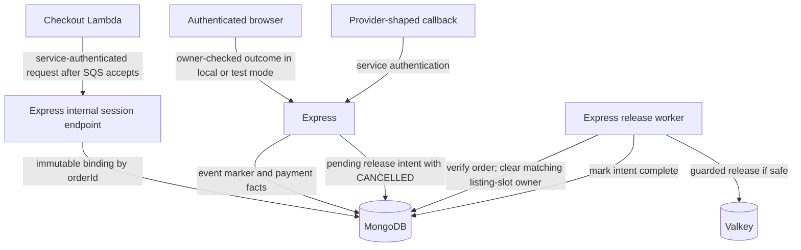

# Payments

## Purpose

This document defines the mock payment-session binding and callback behavior.

## Flow

After SQS accepts the reservation event, the Lambda calls the internal Express mock-session endpoint with service authentication. The endpoint rejects browser requests and requests without valid service authentication. The implementation will select the exact credential mechanism.

The Lambda sends trusted `customerId`, `orderId`, `reservationId`, `listingId`, and `slotId` data. The endpoint creates or reuses the MongoDB session binding by `orderId`.

The binding contains `paymentSessionId`, `customerId`, `orderId`, `reservationId`, `listingId`, `slotId`, and session state. The correlation fields do not change after creation.

The browser can submit a mock success or failure only through an owner-checked route in local or test mode. Express loads the stored binding and calls the shared callback handler. A browser cannot call the service-authenticated provider-shaped callback route.

## Decisions & assumptions

- The first valid provider outcome for an order wins. A conditional MongoDB write sets `paymentOutcome` only when it is absent.
- A repeated `providerEventId` is a no-op. A later conflicting event with a new ID is stored and ignored.
- Provider metadata is correlation data. It does not authorize a callback.
- Express validates callback fields against the server-side payment-session binding.
- `CANCELLED`, the provider-event marker, the first outcome, and its pending release intent commit in one MongoDB transaction.
- The Express release worker re-reads the order before it handles an intent. It skips release for `COMPLETE` orders.
- Before the Valkey call, the worker conditionally clears `listing-slots` ownership only when `currentReservationId` matches the old reservation and `orderId` matches the old order or is unset.
- If the durable slot has no owner because SQS has not arrived, the worker continues to the guarded Valkey release. A newer owner or a secured/completed slot makes the worker skip release without clearing the owner.
- If the conditional clear does not match, the worker re-reads the order and slot. It continues only for an unowned slot; it skips a newer or secured owner.
- The Valkey script checks the old reservation owner and release-operation marker. It returns the slot and clears the customer claim only once.
- A new checkout can use the slot only after the guarded Valkey release succeeds and clears the old customer claim.
- The worker marks the MongoDB release intent complete after the Valkey script succeeds. A retry after a crash uses the same operation ID.
- A success before SQS keeps the order `PAYMENT_PENDING`; reservation facts later complete it.
- A failure or expiry before SQS can cancel the order. A delayed SQS event cannot reopen it.
- The processor is mocked. A real provider remains outside this scope.

## Gotchas

The mock outcome route requires the authenticated order owner and is disabled outside local and test environments.

If a callback transaction fails before commit, MongoDB rolls back its event marker and facts. The provider can retry the same event.

If the worker stops after it clears the matching MongoDB slot owner but before Valkey release, the durable intent remains pending. A later pass re-reads the order and slot, then retries the guarded release.

If a release worker stops after Valkey releases the slot, the pending MongoDB intent remains. A retry uses the same operation ID and does not add the slot twice.

## Change log

### 2026-09-23

- Moved mock-session ownership, callback trust, and cancellation release rules into this facet.
