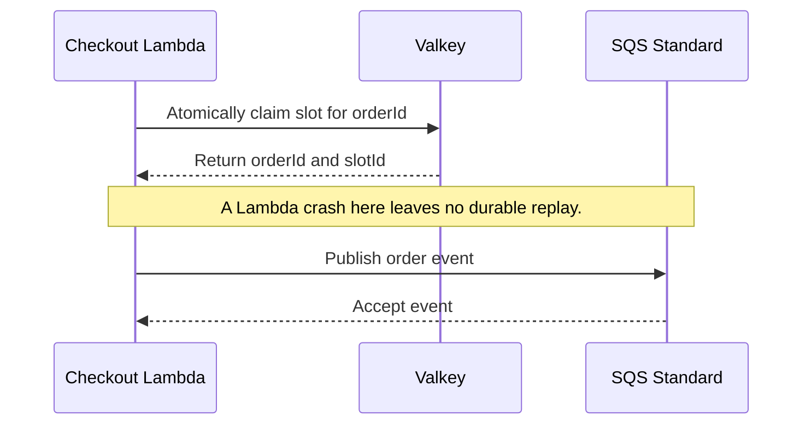

# Reliability

## Purpose

This document defines failure behavior, recovery limits, and operational signals.

## Flow

### Valkey pop-to-SQS crash gap

Lambda claims a slot before it publishes the SQS event. A crash between these steps can leave a slot claim without a durable order record.

Possible future mitigation: move the atomic claim to a durable store. A DynamoDB conditional write can record the claim, and DynamoDB Streams can feed SQS through EventBridge Pipes. Kafka can carry a claim event after a durable claim or outbox write. A Kafka write after the Valkey pop alone does not close this gap.

### Duplicate SQS delivery

SQS can deliver the same event more than once. The worker uses `orderId` for an idempotent MongoDB upsert and acknowledges each delivery after MongoDB confirms the write.

### Concurrent slot growth

The listing feature writes the listing timestamp inside each slot-growth transaction before it counts slots. This write makes concurrent transactions serialize on the listing document. Deterministic sequential IDs and the unique `{ listingId, slotId }` index reject duplicate slots.

### Slot reallocation after cancellation

Slot reallocation remains planned work. It must use `orderId` as the slot owner and must not return a slot to Valkey when MongoDB ownership is unclear.

## Decisions & assumptions

- Listing setup fails closed. Express does not publish an unverified Valkey seed.
- The Lambda rejects inactive, unpublished, sold-out, or ambiguous claims.
- SQS Standard can duplicate and reorder events. The Express worker processes events idempotently.
- The worker acknowledges a message only after a successful MongoDB write.
- The order model has no payment facts or lifecycle subdocuments. Payment callbacks, status transitions, and release recovery remain planned work.
- Full Valkey state loss after a pop may leave ownership unclear. Do not rebuild ambiguous inventory from incomplete MongoDB facts.
- Valkey also stores Better Auth session state. A missing or unavailable session denies checkout. Do not fall back to MongoDB. After full Valkey loss, customers sign in again.
- Keep separate Valkey key namespaces for auth and inventory. Both the authorizer and checkout Lambda need Valkey access. A shared Valkey outage stops both session checks and reservations.
- Planned metrics include claim success, sold-out responses, duplicate attempts, SQS publish failures, worker retries, persistence latency, slot growth, and invariant violations.
- Planned structured logs include `orderId`, listing ID, slot ID, and request correlation data. They exclude customer secrets.

## Gotchas

The design has no durable replay if Lambda stops after the Valkey pop and before SQS accepts the event.

Standard SQS provides at-least-once delivery and can reorder messages. It is transport, not the order store.

Fail-closed behavior protects inventory ownership but can keep checkout unavailable until an operator resolves the ambiguity. This increment does not define an operator recovery procedure.

MongoDB stores Better Auth users and credentials, plus business data. Better Auth sessions use Valkey secondary storage.

DynamoDB is only a future alternative. Any such design must use a DynamoDB conditional write as the atomic claim, then DynamoDB Streams and EventBridge Pipes to send events to SQS.

## Change log

### 2026-09-23

- Documented the Valkey-to-SQS crash gap and idempotent order persistence.
- Added transaction and unique-index safeguards for concurrent slot growth.
- Deferred payment and release recovery details beyond the model foundation.
