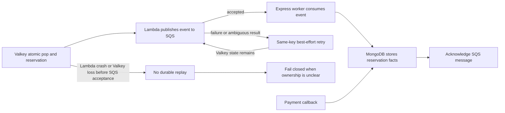

# Reliability

## Purpose

This document defines failure behavior, recovery limits, and operational signals.

## Flow

Valkey reservation and SQS publication are separate operations. The system accepts a crash gap between them.

A same-key retry can reuse a reservation while Valkey retains its state. This is best effort. It is not a durable replay mechanism.

## Decisions & assumptions

- Listing setup fails closed. Express does not publish an unverified Valkey seed.
- The Lambda rejects inactive, unpublished, sold-out, or ambiguous reservations.
- SQS Standard can duplicate and reorder events. The Express worker processes events idempotently.
- The worker acknowledges a message only after a successful MongoDB write.
- Payment callback and SQS facts can arrive in either order. The order reconciler uses stored facts and terminal-state rules.
- A pending release intent survives a worker crash. The Express release worker retries the guarded Valkey operation.
- Before Valkey release, the worker conditionally clears the MongoDB `listing-slots` owner when `currentReservationId` matches the old reservation and `orderId` matches the old order or is unset.
- A payment-first cancellation with no durable slot owner can continue to the guarded Valkey release. A newer owner or a secured/completed slot is not cleared or released.
- If the worker stops after the MongoDB owner clear, the pending intent lets a later pass retry the guarded Valkey release.
- The Valkey operation marker prevents a retry from adding the slot twice.
- Full Valkey state loss after a pop may leave ownership unclear. Do not rebuild ambiguous inventory from incomplete MongoDB facts.
- Planned metrics include reservation success, sold-out responses, duplicate attempts, SQS publish failures, payment outcomes, worker retries, persistence latency, reconciliation count, releases, and invariant violations.
- Planned structured logs include correlation, attempt, reservation, event, and listing identifiers. They exclude customer secrets.

## Gotchas

The design has no durable replay if Lambda stops after the Valkey pop and before SQS accepts the event.

Standard SQS provides at-least-once delivery and can reorder messages. It is transport, not the order store.

Fail-closed behavior protects inventory ownership but can keep checkout unavailable until an operator resolves the ambiguity. This increment does not define an operator recovery procedure.

MongoDB keeps authentication and business data together, but the design depends on unique indexes and idempotent writes.

DynamoDB is only a future alternative. Any such design must use a DynamoDB conditional write as the atomic claim, then DynamoDB Streams and EventBridge Pipes to send events to SQS.

## Change log

### 2026-09-23

- Moved failure rules, release retries, observability plans, and trade-offs into this facet.
