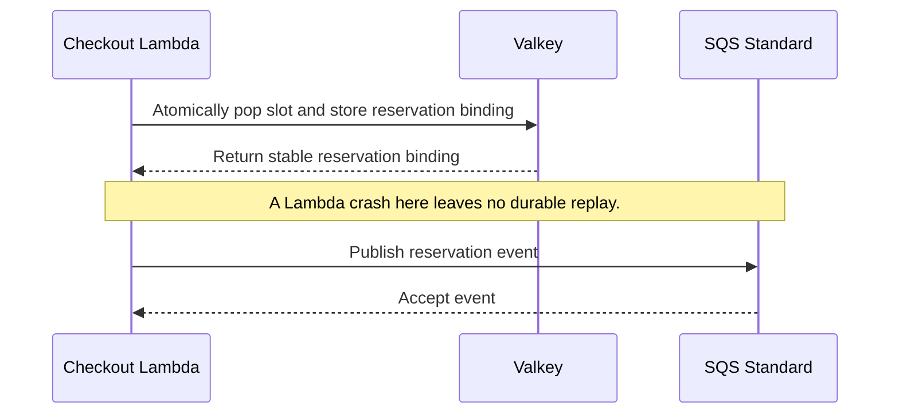
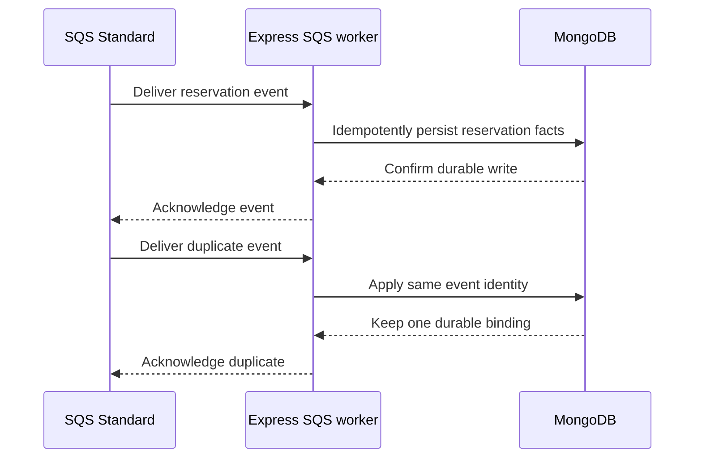
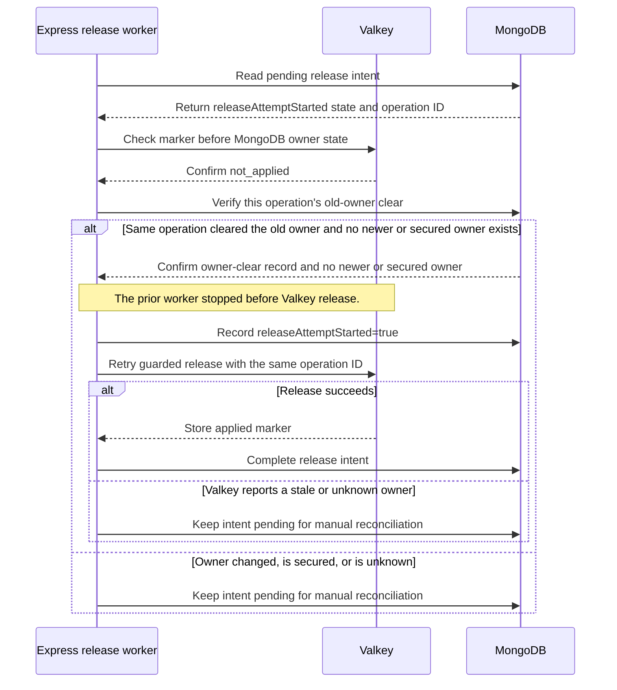
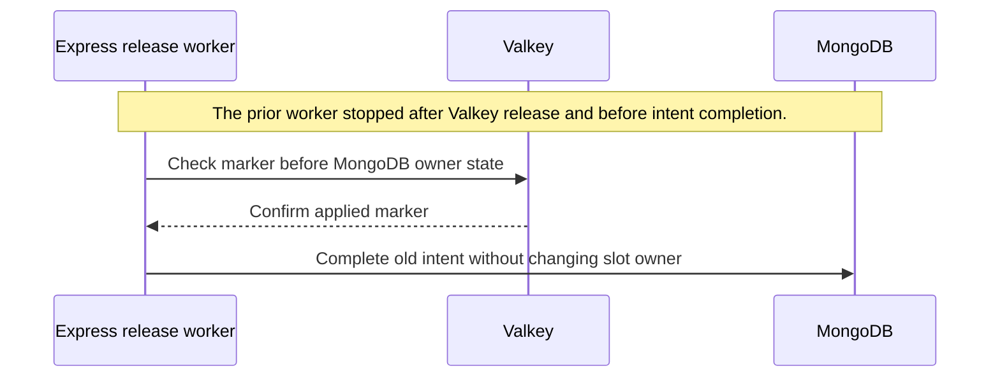
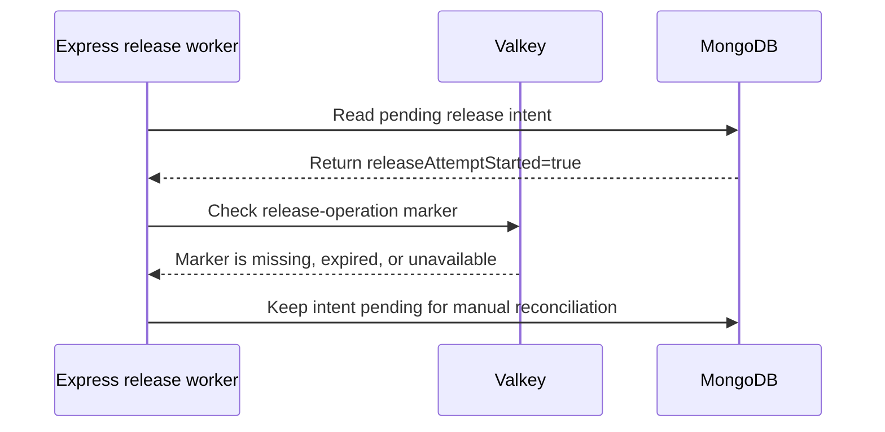

# Reliability

## Purpose

This document defines failure behavior, recovery limits, and operational signals.

## Flow

### Valkey pop-to-SQS crash gap

Lambda claims a slot before it publishes the SQS event. A crash between these steps can leave a reservation without a durable event.

Possible future mitigation: move the atomic claim to a durable store. A DynamoDB conditional write can record the claim, and DynamoDB Streams can feed SQS through EventBridge Pipes. Kafka can carry a claim event after a durable claim or outbox write. A Kafka write after the Valkey pop alone does not close this gap.

### Duplicate SQS delivery

SQS can deliver the same event more than once. The worker uses the event identity and acknowledges each delivery after MongoDB confirms the write.

Current mitigation: use `eventId` and `orderId` for an idempotent MongoDB upsert. A duplicate event can set only the same SQS-owned reservation fields. It cannot create another order, replace payment facts, or reopen a terminal order.

### Slot reallocation retry after a worker crash

A fresh intent starts with `releaseAttemptStarted=false`. The worker initializes a Valkey `not_applied` marker before release. Each retry checks the marker before MongoDB ownership. A retry can resume after MongoDB records this operation's owner clear. It can use either flag value only when Valkey confirms `not_applied` and MongoDB shows no newer or secured owner. It records `releaseAttemptStarted=true` before it calls the release script. A crash before MongoDB records the owner clear resumes the normal release flow in [Payments](payments.md).

Current mitigation: MongoDB keeps the pending release intent across an Express restart. The worker resumes from that intent. A scheduled job can also scan pending intents. Kafka or DynamoDB Streams could notify another worker, but only if the committed intent reaches that stream. The worker still needs the same Valkey marker and MongoDB owner checks.

#### Crash after MongoDB owner clear

MongoDB records which release operation cleared the old owner. The worker retries only when Valkey reports `not_applied` and no newer or secured owner exists.

#### Crash after Valkey release

Valkey may release the slot before MongoDB completes the intent. The applied marker lets the worker finish without changing a newer owner.

#### Unknown release state

A missing, expired, or unavailable marker cannot prove whether Valkey released the slot. The worker leaves the intent pending for manual reconciliation.

Valkey reservation and SQS publication are separate operations. The system accepts a crash gap between them.

A same-key retry can reuse a reservation while Valkey retains its state. This is best effort. It is not a durable replay mechanism.

The provider callback may contain `orderId` and `paymentSessionId`, but may omit `reservationId` or `slotId`. Release never relies on webhook slot fields. Trusted slot ownership comes from the SQS event. A payment-first failure stays `AWAITING_FACTS` and cannot release a slot until reconciliation validates the immutable binding.

## Decisions & assumptions

- Listing setup fails closed. Express does not publish an unverified Valkey seed.
- The Lambda rejects inactive, unpublished, sold-out, or ambiguous reservations.
- SQS Standard can duplicate and reorder events. The Express worker processes events idempotently.
- The worker acknowledges a message only after a successful MongoDB write.
- Payment callback and SQS facts can arrive in either order. The order stays `AWAITING_FACTS` until both facts exist. Reconciliation validates the immutable SQS binding before it sets a terminal state.
- MongoDB atomically assigns each new authenticated provider event a per-order `receiveSequence` with its event marker and pending fact. Callback insertion, SQS binding persistence, reconciliation, and terminal transitions serialize through the same per-order record. Each terminal transition selects the lowest-sequence committed event that matches the binding. Duplicate provider IDs do not get a new sequence. Provider timestamps do not choose the winner.
- A callback that commits after binding persistence but before pending-event reconciliation participates in reconciliation. A callback insert that races with terminalization serializes through the per-order record, and a retry checks committed events by sequence.
- A pending release intent survives a worker crash. The Express release worker retries the guarded Valkey operation.
- A fresh MongoDB release intent starts with `releaseAttemptStarted=false`. The worker initializes a Valkey `not_applied` marker before the first release call and records `releaseAttemptStarted=true` before it calls the release script.
- The release worker checks the Valkey operation marker before it checks MongoDB slot ownership. An applied marker lets it complete the old intent without changing a newer owner.
- Only a positively known `not_applied` marker allows the MongoDB owner guard. A newer or secured owner keeps the old intent pending for manual reconciliation. A missing marker after an attempt, an expired marker, or an unavailable marker is ambiguous and also keeps the intent pending.
- A Valkey stale-owner result also keeps the intent pending. The worker does not mark the old intent complete.
- Before Valkey release, the worker conditionally clears the MongoDB `listing-slots` owner when `currentReservationId` matches the old reservation and `orderId` matches the old order or is unset.
- A payment-first failure or expiry cannot release inventory because its callback may omit `reservationId` or `slotId`. The slot stays held until the SQS fact supplies and validates ownership. A missing durable owner does not prove ownership.
- The worker records which operation cleared the old MongoDB owner. A retry can continue only when that operation still owns the release hold and no newer owner exists.
- Keep the Valkey operation marker while its MongoDB intent is pending. It prevents an old retry from adding a released slot twice.
- Full Valkey state loss after a pop may leave ownership unclear. Do not rebuild ambiguous inventory from incomplete MongoDB facts.
- Valkey also stores Better Auth session state. A missing or unavailable session denies checkout. Do not fall back to MongoDB. After full Valkey loss, customers sign in again; the design does not claim durable sessions.
- Keep separate Valkey key namespaces for auth and inventory. Both the authorizer and checkout Lambda need Valkey access. A shared Valkey outage stops both session checks and reservations.
- Planned metrics include reservation success, sold-out responses, duplicate attempts, SQS publish failures, payment outcomes, worker retries, persistence latency, reconciliation count, releases, and invariant violations.
- Planned structured logs include correlation, attempt, reservation, event, and listing identifiers. They exclude customer secrets.

## Gotchas

The design has no durable replay if Lambda stops after the Valkey pop and before SQS accepts the event.

Standard SQS provides at-least-once delivery and can reorder messages. It is transport, not the order store.

Fail-closed behavior protects inventory ownership but can keep checkout unavailable until an operator resolves the ambiguity. This increment does not define an operator recovery procedure.

MongoDB stores Better Auth users and credentials, plus business data. Better Auth sessions use Valkey secondary storage.

DynamoDB is only a future alternative. Any such design must use a DynamoDB conditional write as the atomic claim, then DynamoDB Streams and EventBridge Pipes to send events to SQS.

## Change log

### 2026-09-23

- Moved failure rules, release retries, observability plans, and trade-offs into this facet.
- Added fail-closed behavior for Valkey-backed auth sessions and documented session loss after full Valkey loss.
- Added SQS-backed payment binding and delayed guarded release after payment-first failure.
- Serialized callback insertion and terminal selection by per-order receive sequence.
- Split the crash gap, duplicate delivery, and release crash outcomes into separate diagrams.
- Linked release recovery to the normal guarded release flow in Payments.
- Added context before each reliability diagram.
- Named the cancellation recovery flow slot reallocation while preserving release-operation identifiers.
- Added current and future mitigations for the claim gap, duplicate SQS delivery, and slot reallocation retries.
