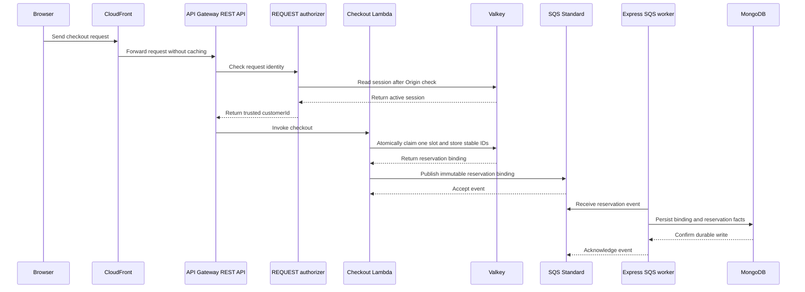
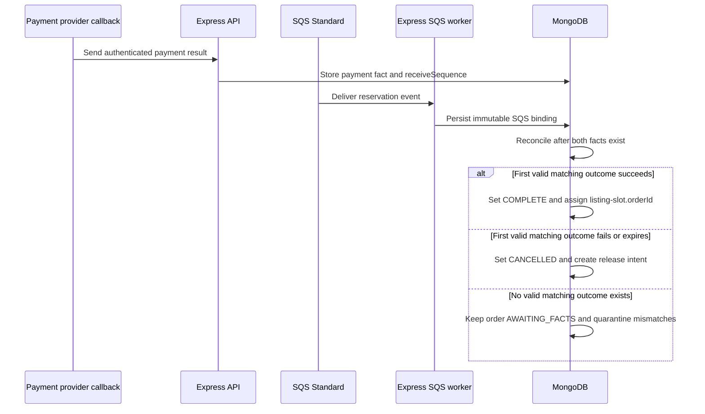

# System design

## Purpose

This document is the short entry point for the flash-sale design. It shows the master flow and links to each design facet.

## Flow

### Payment outcome and terminal order

Payment and SQS facts can arrive in either order. Reconciliation waits for both facts and selects the first valid matching callback by `receiveSequence`.

The browser uses the Next.js page for the storefront. It sends the purchase request directly to the configured CloudFront checkout endpoint. CloudFront routes it through API Gateway to the checkout Lambda.

Express does not invoke Lambda and does not proxy the purchase request. Express owns listing setup, status and result reads, SQS consumption, payment callbacks, and MongoDB persistence.

The authorizer checks the Better Auth session in Valkey. MongoDB stores users, credentials, and business data. The authorizer does not call Express or MongoDB.

The Lambda generates candidate `orderId` and `paymentSessionId` values before it claims a Valkey slot. The atomic claim stores these values with the reservation. A same-key retry uses the stored values. Lambda sends the immutable order, customer, listing, slot, and payment-session binding through SQS. SQS is the only Lambda-to-Express bridge. The Express worker writes the binding to MongoDB. The mock payment page waits for this write before it shows owner-checked outcome buttons. A provider webhook can arrive before SQS; it stores payment facts and leaves the order `AWAITING_FACTS` until SQS supplies the binding.

The order stays `AWAITING_FACTS` until MongoDB has both payment result and SQS reservation facts. If failure arrives first, the order stays `AWAITING_FACTS` and the slot remains held. After SQS supplies slot ownership, reconciliation can cancel the order and create a guarded release intent. Slot reallocation after order cancellation returns the slot to the Valkey pool; a later checkout may claim it.

Each listing has `stockTotal` physical slots and a hidden subset `reserveSlots`. The advertised count is `publicStock = stockTotal - reserveSlots`. Express seeds all `stockTotal` slots in one claimable Valkey pool. An atomic pop prevents duplicate claims. At most `stockTotal` orders can reach `COMPLETE`.

Checkout reports sold out only when the pool is empty. The live storefront wording remains open when public remaining reaches zero while slots remain.

## Facets

- [Listing and inventory](listing-and-inventory.md): listing publication, slot seeding, inventory ownership, and the future DynamoDB alternative.
- [Checkout](checkout.md): deployed request path, reservation contract, idempotency, and the Valkey-to-SQS gap.
- [Orders](orders.md): durable order facts, field ownership, indexes, and state transitions.
- [Payments](payments.md): mock sessions, callback checks, first-outcome rules, and slot reallocation after order cancellation.
- [Identity and access](identity-and-access.md): trust boundaries and the selected REST REQUEST authorizer.
- [Reliability](reliability.md): failure behavior, recovery limits, observability, and architecture trade-offs.
- [Testing strategy](testing-strategy.md): planned test layers and acceptance checks.
- [Implementation roadmap](implementation-roadmap.md): increments, choices, and verification plans.

## Change log

### 2026-09-22

- Added the selected architecture, contracts, data models, failure paths, and design diagrams.
- Added immutable payment-session binding, partial indexes, terminal winners, and Express SQS worker recovery.
- Added atomic provider-event processing and retry after an interrupted callback transaction.

### 2026-09-23

- Added authenticated mock outcomes, fail-closed manual Valkey-loss recovery, active-owner indexes, and compare-and-delete release protection.
- Clarified guarded slot release and durable listing-slot transitions.
- Added immutable mock-session `customerId` binding and owner checks.
- Recorded the fail-closed choice for full Valkey loss after a pop and before SQS publication.
- Clarified that DynamoDB must own any future atomic slot claim and EventBridge Pipes must bridge Streams to SQS.
- Replaced durable republish claims with best-effort same-key retry and the known pop-to-SQS crash gap.
- Made the first valid payment outcome immutable and added atomic cancellation release intents with a retrying Express worker.
- Required service authentication for the provider-shaped callback route and kept browser outcomes owner-checked.
- Clarified that a same-key retry returns an accepted result only after SQS acknowledges publication.
- Replaced the long system-design document with a master flow and links to focused design facets.
- Corrected the deployed checkout route to CloudFront, API Gateway, and Lambda.
- Selected a Better Auth session-checking API Gateway Lambda authorizer.
- Moved Better Auth sessions to Valkey secondary storage and selected REST REQUEST authorization.
- Required Origin rejection before Better Auth or Valkey access.
- Made SQS the only Lambda-to-Express bridge and moved the mock payment binding into the SQS event.
- Kept orders in `AWAITING_FACTS` until payment and reservation facts both exist.
- Split the master sequence diagram at durable reservation persistence.
- Added the payment fact and terminal order stage to the master flow.
- Defined physical stock, the hidden reserve count, the public count, and the one-pool Valkey claim model.
- Named the cancellation flow slot reallocation after order cancellation while preserving technical release markers.
