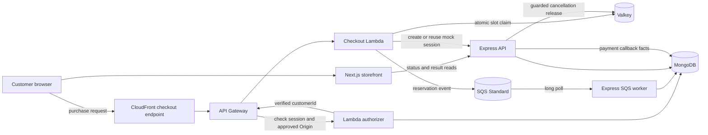

# System design

## Purpose

This document is the short entry point for the flash-sale design. It shows the master flow and links to each design facet.

## Flow

The browser uses the Next.js page for the storefront. It sends the purchase request directly to the configured CloudFront checkout endpoint. CloudFront routes it through API Gateway to the checkout Lambda.

Express does not invoke Lambda and does not proxy the purchase request. Express owns listing setup, status and result reads, SQS consumption, payment callbacks, and MongoDB persistence.

The Lambda creates the authoritative `orderId`, claims one Valkey slot, publishes an event to SQS, and creates or reuses a mock payment session through an internal Express endpoint.

## Facets

- [Listing and inventory](listing-and-inventory.md): listing publication, slot seeding, inventory ownership, and the future DynamoDB alternative.
- [Checkout](checkout.md): deployed request path, reservation contract, idempotency, and the Valkey-to-SQS gap.
- [Orders](orders.md): durable order facts, field ownership, indexes, and state transitions.
- [Payments](payments.md): mock sessions, callback checks, first-outcome rules, and cancellation release intents.
- [Identity and access](identity-and-access.md): trust boundaries and the selected API Gateway authorizer.
- [Reliability](reliability.md): failure behavior, recovery limits, observability, and architecture trade-offs.
- [Testing strategy](testing-strategy.md): planned test layers and acceptance checks.
- [Implementation roadmap](implementation-roadmap.md): increments, choices, and verification plans.

## Change log

### 2026-09-22

- Added the selected architecture, contracts, data models, failure paths, and design diagrams.
- Added immutable payment-session binding, partial indexes, terminal winners, and Express SQS worker recovery.
- Added atomic provider-event processing and retry after an interrupted callback transaction.

### 2026-09-23

- Added authenticated mock outcomes, fail-closed manual Valkey-loss recovery, active-owner indexes, and compare-and-delete release protection.
- Clarified payment-first release without a durable slot owner and durable listing-slot transitions.
- Added immutable mock-session `customerId` binding and owner checks.
- Recorded the fail-closed choice for full Valkey loss after a pop and before SQS publication.
- Clarified that DynamoDB must own any future atomic slot claim and EventBridge Pipes must bridge Streams to SQS.
- Replaced durable republish claims with best-effort same-key retry and the known pop-to-SQS crash gap.
- Made the first valid payment outcome immutable and added atomic cancellation release intents with a retrying Express worker.
- Required service authentication for the provider-shaped callback route and kept browser outcomes owner-checked.
- Clarified that a same-key retry returns an accepted result only after SQS acknowledges publication.
- Replaced the long system-design document with a master flow and links to focused design facets.
- Corrected the deployed checkout route to CloudFront, API Gateway, and Lambda.
- Selected a Better Auth session-checking API Gateway Lambda authorizer.
