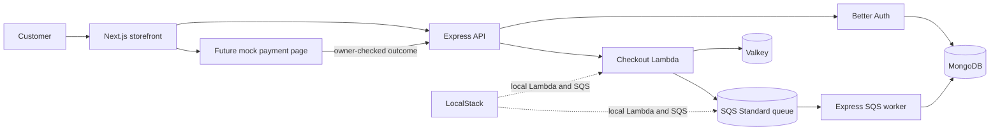
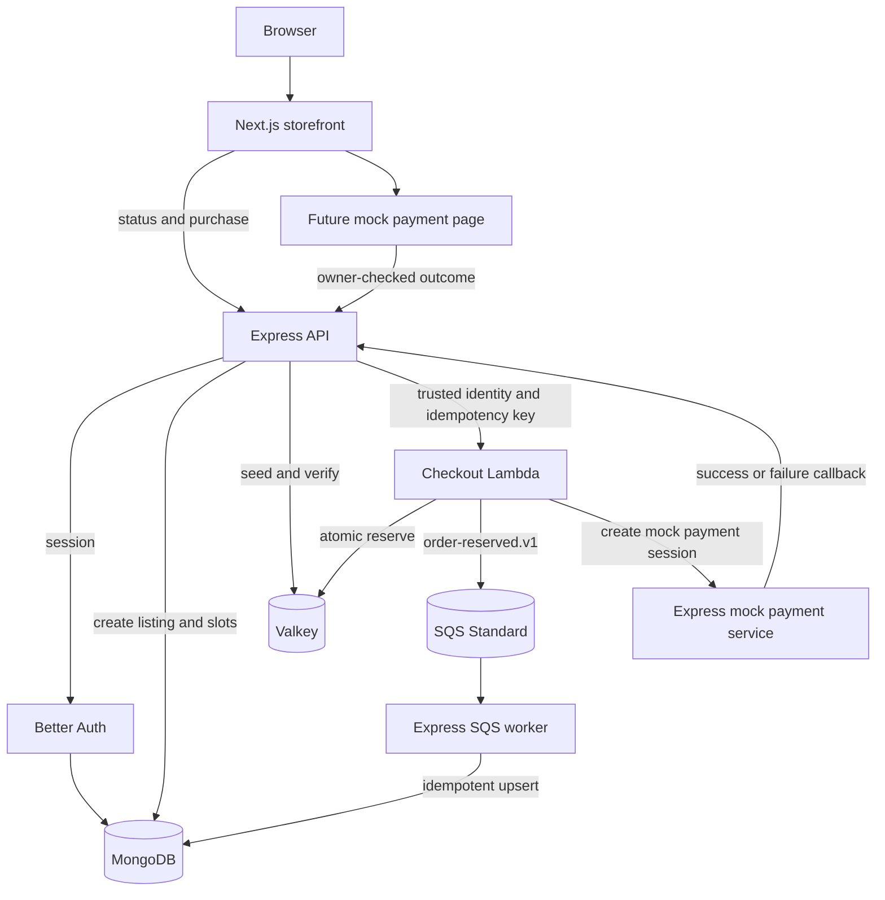
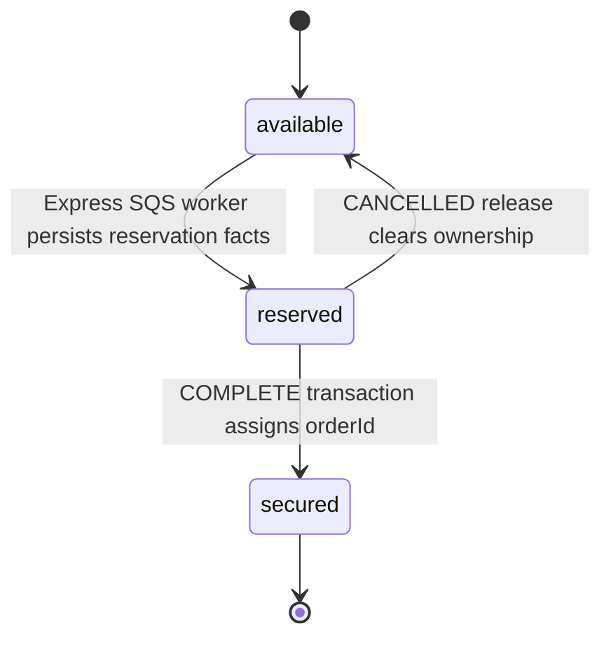
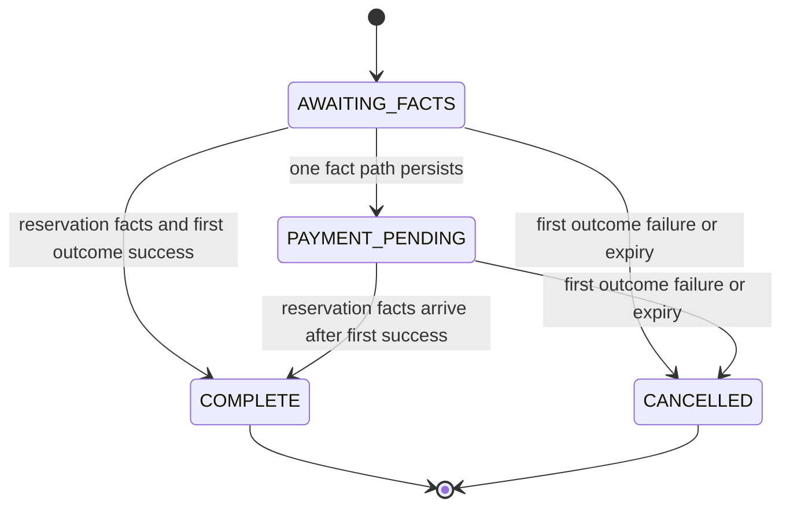
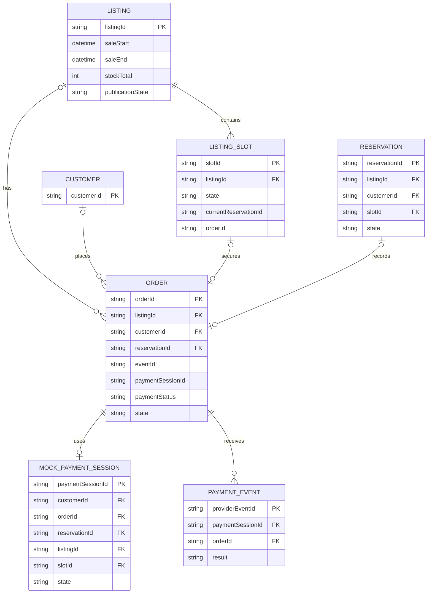
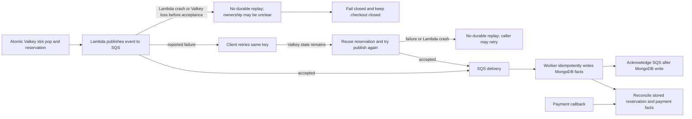

# System design

## Purpose

This document records the current architecture, contracts, data models, failure rules, and verification plan.

### Source requirements

The take-home requires a high-throughput flash sale with these behaviors:

- Configure a sale start and end time.
- Sell one product with limited stock.
- Allow one item per user.
- Expose sale status, purchase attempt, and purchase result endpoints.
- Provide a React frontend.
- Support high throughput and resilience.
- Prevent overselling.
- Include unit, integration, and stress tests.
- Include a system diagram, design choices, trade-offs, run instructions, and expected test results.

This document records the selected first architecture increment.

### Scope

This increment records architecture, contracts, data models, failure handling, and verification plans.

It does not create runtime code, dependencies, lockfiles, Docker files, generated diagrams, migrations, or runtime configuration.

## Decisions & assumptions

### Assumptions

- The sale has one listing and one product in the initial implementation.
- The initial purchase quantity is exactly one.
- The authenticated customer is the unit for the one-item rule.
- Only one `COMPLETE` order is allowed for a customer and listing.
- A failed or expired payment releases its slot and permits a new checkout with a new idempotency key.
- The cancelled attempt remains bound to its original idempotency key and order.
- MongoDB, Valkey, and LocalStack are available in later local integration work.
- LocalStack covers Lambda and SQS during local development.
- LocalStack supplies the checkout Lambda invocation and SQS queue.
- The Express SQS worker long-polls and consumes SQS directly.
- This design has no SQS-to-Lambda event source mapping.
- Standard SQS provides at-least-once delivery. It can duplicate and reorder messages. The worker must handle both cases idempotently. ([AWS documentation](https://docs.aws.amazon.com/en_gb/AWSSimpleQueueService/latest/SQSDeveloperGuide/standard-queues.html))
- Lambda pops a Valkey slot before it publishes the SQS event. A crash or Valkey loss in this gap has no durable replay guarantee.
- A same-key request can retry SQS publication while Valkey retains the reservation. This retry is best effort and does not provide durable resume.
- The payment processor is mocked initially and is not a current external dependency.
- Better Auth protects the purchase endpoint.
- The checkout Lambda receives a trusted customer identity from Express.
- The Lambda generates the authoritative `orderId` before it reserves a slot.
- A future storefront mock payment page exposes success and failure buttons.
- SQS dead-letter, visibility timeout, batch size, and polling values are implementation decisions for a later increment.

### Architecture decisions

### Service ownership

Express owns listing setup, authentication, status reads, purchase invocation, durable MongoDB persistence, payment callback handling, and event-driven order reconciliation.

The checkout Lambda owns initial logical order creation, the hot-path Valkey reservation, SQS publication, and mocked payment-session creation.

The Lambda does not write the final completed sale to MongoDB on the hot path.

The Express SQS worker writes reservation facts to MongoDB after event delivery.

The payment callback writes payment facts to MongoDB.

Both paths call one event-driven reconciliation and state-transition function.

### Data authority

MongoDB is the final persistence layer for completed sales and durable order facts.

Valkey is the temporary real-time reservation authority during the sale.

SQS transports reservation events to MongoDB. It is not the order store.

Valkey holds the hot-path reservation before MongoDB writes the event facts. This temporary state does not provide a durable replay guarantee.

The design accepts a dual-write gap between the Valkey reservation and SQS publication.

The Valkey reservation and idempotency record support a best-effort same-key retry while Valkey state remains intact. No durable checkpoint or background reconciler closes the gap.

If Lambda stops after the Valkey pop and before SQS accepts the event, the attempt can have no queued order event. If Valkey also loses its state, the system cannot replay or identify that reservation from a durable record.

The Lambda creates the authoritative `orderId` and includes it in the SQS event and payment-session metadata.

### Listing publication

Express first creates the listing and durable `listing-slot` records in MongoDB.

Express then seeds the Valkey availability list.

Express verifies the seed before it marks the listing active.

An unverified listing remains unpublished and cannot accept purchases.

### Rejected alternatives

The design rejects Express as the atomic inventory authority with Lambda as an SQS-only worker.

An SQS message sent before a slot claim records intent only. It does not prove that the customer owns a slot. Concurrent consumers must still use one atomic claim, and only a successful claim can confirm a reservation. This design does not select that flow.

The design rejects PostgreSQL for business data with MongoDB only for Better Auth.

The design rejects React Router and selects Next.js.

The design rejects a real payment provider in the first implementation and selects a mock processor with the real callback shape.

DynamoDB conditional writes and Streams remain a future alternative, not part of the selected architecture. That alternative must make DynamoDB the owner of the atomic slot claim. A successful conditional write must claim the slot and enforce the customer and idempotency rules before its Stream event exists. Amazon EventBridge Pipes can then connect DynamoDB Streams to SQS; DynamoDB Streams do not connect directly to SQS. ([AWS Pipes tutorial](https://docs.aws.amazon.com/eventbridge/latest/userguide/pipes-tutorial-create-dynamodb-sqs.html))

### Invariants

1. A purchase reserves at most one slot.
2. A customer has at most one non-`CANCELLED` order for a listing, and at most one `COMPLETE` order.
3. A slot has at most one owner.
4. Completed orders for a listing never exceed its stock total.
5. A request with the same idempotency key returns the same `orderId` and payment session.
6. A new idempotency key cannot bypass a completed purchase, but it can start a new checkout after cancellation.
7. A duplicate or reordered event does not create a second order.
8. An unpublished, not-yet-started, or ended listing cannot reserve a slot.
9. An SQS message is acknowledged only after an idempotent MongoDB write succeeds.
10. A same-key retry while Valkey state remains intact reuses the existing reservation and does not pop a second slot.
11. A crash or Valkey loss after the slot pop and before SQS publication has no durable replay guarantee.
12. A slot release adds the slot to the available list at most once.
13. `COMPLETE` and `CANCELLED` are terminal for the original order.
14. A cancelled customer claim is released only by compare-and-delete for its old reservation identifier.
15. Full Valkey state loss closes checkout and never silently reopens ambiguous slots.

## Flow

The Lambda, Express SQS worker, and payment callback exchange facts through the contracts below. Event-driven reconciliation combines facts already stored in MongoDB. It does not scan Valkey or republish SQS events.

### API contract draft

These routes are drafts. The implementation increment will define the exact schema, error codes, limits, and authentication middleware.

### Get sale status

`GET /api/sales/:listingId/status`

This route is public.

The response contains `listingId`, `state`, `saleStart`, `saleEnd`, `stockTotal`, `availableCount`, and `serverTime`.

The `state` value is one of `unpublished`, `scheduled`, `active`, `ended`, or `sold_out`.

The response does not expose customer data.

### Attempt a purchase

`POST /api/sales/:listingId/purchase`

This route requires a Better Auth session.

The request body contains one client-generated `idempotencyKey`.

The initial contract does not accept a quantity other than one.

Express takes the customer identity from the authenticated session.

Repeated requests from the same authenticated session and same logical attempt use the same idempotency key.

Express invokes the checkout Lambda with the trusted identity, listing identifier, and idempotency key.

The successful response contains `attemptId`, authoritative `orderId`, `reservationId`, `paymentSessionId`, `state`, and `idempotencyKey`.

The response state can be `accepted`, `already_accepted`, `sold_out`, `not_started`, `ended`, or `already_purchased`.

`already_purchased` applies only when the customer already has a `COMPLETE` order for the listing.

After `CANCELLED`, the same idempotency key returns the cancelled attempt, and a new idempotency key can start a new checkout.

If SQS publication fails after a Valkey reservation, the API returns a retryable service error.

The client can retry with the same idempotency key. While Valkey retains the reservation, Lambda can reuse it and try SQS publication again without popping another slot.

Lambda creates the mock payment session and returns an accepted result only after SQS acknowledges the event.

This retry is best effort. A Lambda crash after the pop, Valkey state loss, or an ambiguous publish result has no durable replay guarantee.

### Read a purchase result

`GET /api/sales/:listingId/purchases/:attemptId`

This route requires the same authenticated customer.

The response contains `attemptId`, `listingId`, `reservationId`, `orderId`, `paymentSessionId`, `state`, and `updatedAt`.

The result `state` is one of `AWAITING_FACTS`, `PAYMENT_PENDING`, `COMPLETE`, or `CANCELLED`.

The route does not reveal another customer's attempt.

### Mock payment page and callback

The future storefront page is `/mock-payment/:paymentSessionId`.

The page displays success and failure buttons for local tests.

`GET /api/payments/mock/sessions/:paymentSessionId` returns the mock session state and trusted correlation metadata needed by that page.

This route requires the authenticated customer who owns the order and a local or test-only feature flag.

Express checks the immutable `customerId` stored in the mock session against the authenticated session.

`POST /api/payments/mock/callback` accepts the provider-shaped result for the mock payment service. This route requires service authentication. It is not a browser route.

The future page sends `POST /api/payments/mock/outcome` with the selected success or failure button.

This browser outcome route requires the authenticated order owner and a local or test-only feature flag.

Its body contains only `paymentSessionId` and the selected result.

Express loads the server-side binding and creates the provider-shaped callback data.

Express translates the browser outcome into the provider-shaped callback contract.

Express applies that contract through the same internal callback handler that the authenticated service route uses.

The mock outcome route is disabled outside local and test environments.

The callback body contains `paymentSessionId`, `providerEventId`, `orderId`, `reservationId`, `listingId`, `slotId`, and `result`, where `result` is `success`, `failure`, or `expired`.

The mock page calls only the owner-checked outcome route. It does not call the provider-shaped callback route, Valkey, or MongoDB.

After SQS publication, Lambda calls an internal Express mock-payment endpoint with service authentication.

The endpoint receives the trusted `customerId` from Lambda, creates the immutable `mock-payment-sessions` record in MongoDB, and returns the stable `paymentSessionId`.

`POST /internal/mock-payment-sessions` is not a browser route. It is idempotent by `orderId`.

Provider metadata is correlation data and is not authorization.

The provider-shaped callback route requires service authentication. The browser cannot call it, even with an authenticated customer session.

The server stores an immutable mock payment-session binding keyed by `paymentSessionId`.

The binding is unique by `orderId` and contains `customerId`, `orderId`, `reservationId`, `listingId`, `slotId`, and session state.

Express resolves `reservationId`, `listingId`, and `slotId` from this binding before any state change.

Express validates callback correlation fields against the binding and never treats provider metadata as authorization.

The callback validates the payment session and reservation facts before it applies the result.

Payment-first callbacks upsert an order stub by `orderId`.

The unique provider-event marker makes a repeated callback a no-op. The first valid provider outcome for an order is immutable. A later conflicting outcome is recorded as an ignored event and cannot change the order or release its slot.

A real provider must also pass its signature and provider event checks.

The mock page and endpoints are future features. This increment does not implement them.

### SQS event contract draft

The queue carries an `order-reserved.v1` event.

The event body contains:

```json
{
  "eventId": "stable-event-id",
  "eventType": "order-reserved.v1",
  "occurredAt": "2026-09-22T00:00:00.000Z",
  "orderId": "authoritative-order-id",
  "listingId": "listing-id",
  "reservationId": "reservation-id",
  "attemptId": "attempt-id",
  "customerId": "customer-id",
  "slotId": "slot-id",
  "priceSnapshot": {
    "amount": 1000,
    "currency": "USD"
  },
  "quantity": 1,
  "idempotencyKey": "client-key"
}
```

`eventId`, `orderId`, `reservationId`, and `idempotencyKey` support idempotent processing of duplicate delivery.

The Express SQS worker upserts reservation facts by `orderId` before it acknowledges the message.

The event contains no payment token or secret.

### Payment callback event

The callback carries `paymentSessionId`, `providerEventId`, `orderId`, `listingId`, `slotId`, `result`, and `occurredAt`.

The callback can arrive before the SQS event.

The callback upserts payment facts and calls the same reconciliation function as the Express SQS worker.

The callback does not overwrite reservation, customer, listing, slot, or price snapshot fields.

### Valkey key model

Key names use the listing identifier as a namespace.

| Key | Type | Purpose |
| --- | --- | --- |
| `sale:{listingId}:meta` | hash | Sale window, publication state, seed version, and stock total. |
| `sale:{listingId}:available-slots` | list | Slot identifiers that are available for reservation. |
| `sale:{listingId}:user-claims` | hash | Customer identifier to reservation identifier mapping. |
| `sale:{listingId}:idempotency` | hash | Idempotency key to stable attempt, order, reservation, and payment-session data. |
| `sale:{listingId}:reservation:{reservationId}` | hash | Order, customer, slot, state, event identifier, and payment-session data. |
| `sale:{listingId}:reservation:{reservationId}:release` | hash | The guarded slot-release operation marker. |

One atomic Valkey operation generates or reuses the order binding, checks the sale window, publication state, idempotency key, customer claim, and available slot, then pops one slot.

The same operation creates the reservation record and customer claim.

A retry with the same idempotency key reuses the same `orderId` and reservation while Valkey retains its state. It can retry event publication best effort.

The customer claim remains for a `COMPLETE` order.

Cancellation releases the claim for a new idempotency key only after the old reservation passes the compare-and-delete check.

A separate atomic release script checks the reservation owner and release marker before it adds a slot to the available list.

The release script compare-and-deletes `sale:{listingId}:user-claims` only when its value matches the old `reservationId`.

If a newer attempt owns the claim, the old release does not delete the newer claim or add the slot again.

The MongoDB `slot-release-operations` marker makes the release operation durable and retryable.

The implementation increment will define serialization, expiry, memory limits, and the exact atomic script boundary.

### MongoDB collection and index model

MongoDB stores Better Auth records and all business data.

### `listings`

Stores the product, sale window, stock total, publication state, and seed version.

Planned indexes include unique `_id` and a state and window lookup for status reads.

### `listing-slots`

Stores one durable record for each slot.

The unique index is `{ listingId: 1, slotId: 1 }`.

The state index is `{ listingId: 1, state: 1 }`.

The durable MongoDB state moves from `available` to `reserved` when the Express SQS worker writes reservation facts, then to `secured` only when the `COMPLETE` transaction assigns `orderId`.

The document stores `currentReservationId` while it is durably reserved.

The document stores the final `orderId` when a payment success and reservation facts complete the order.

Cancellation clears `currentReservationId` and the final `orderId` and moves the document back to `available` after the guarded release operation.

Completion and release update the document only when its current reservation owner matches the old `reservationId` and `orderId`.

### `orders`

Stores the durable order facts and completed sales after either event path creates or updates the order.

Every path has `orderId`, so `{ orderId: 1 }` is a unique index.

The SQS-owned unique indexes are partial indexes: `{ listingId: 1, customerId: 1 }` applies only when its fields exist and `state` is not `CANCELLED`; `{ eventId: 1 }` and `{ reservationId: 1 }` apply only when their fields exist.

Their `partialFilterExpression` checks `$exists: true` for each indexed field.

The filters are `{ listingId: { $exists: true }, customerId: { $exists: true }, state: { $in: ["AWAITING_FACTS", "PAYMENT_PENDING", "COMPLETE"] } }`, `{ eventId: { $exists: true } }`, and `{ reservationId: { $exists: true } }`.

The partial filters prevent payment-first stubs with missing SQS fields from colliding on missing values.

The customer index rejects duplicate active ownership after SQS supplies `customerId` and excludes `CANCELLED` orders so a new checkout can start.

The order stores the listing, customer, slot, price snapshot, attempt, reservation, event, payment facts, `paymentOutcome`, state, and timestamps. `paymentOutcome` is the immutable first valid result: `success`, `failure`, or `expired`.

### `mock-payment-sessions`

Stores an immutable server-side binding for each mock payment session.

The internal Express mock-payment endpoint creates this record in MongoDB.

The unique indexes are `{ paymentSessionId: 1 }` and `{ orderId: 1 }`.

An order can exist before this record. Each order has zero or one mock payment session.

The binding contains `paymentSessionId`, `customerId`, `orderId`, `reservationId`, `listingId`, `slotId`, and session state.

The correlation fields do not change after session creation. Only the session state can move through its allowed values.

### `payment-events`

Stores one provider-event marker for each valid payment callback, including a later conflicting outcome that the system ignores.

The unique index is `{ providerEventId: 1 }`.

The callback inserts this marker in the same MongoDB transaction as the immutable first payment outcome, terminal transition, and any release intent.

The transaction commits the marker, payment facts, and any terminal transition together.

A crash before commit rolls back the marker and facts, so the same provider event can retry.

An existing committed marker makes a repeated provider event a no-op.

The first valid outcome that commits for an order wins. A conditional MongoDB write sets `paymentOutcome` only when it is absent. A later callback with another event ID cannot replace it. The system records that event but ignores its result.

Payment-first order stubs use `orderId` as their identity and do not require SQS-owned fields.

SQS owns reservation, customer, listing, slot, and price snapshot fields.

The payment callback owns payment status, provider, session, and result fields. The first valid provider result is immutable.

Reconciliation derives order state and durable slot ownership.

The Express SQS worker sets `listing-slots.currentReservationId` only when the order is not `CANCELLED` and the slot is unowned or already owned by the same reservation.

A delayed event from an old cancelled order cannot replace a newer reservation owner.

The order starts as `AWAITING_FACTS` when one path creates a durable stub.

The order can use `PAYMENT_PENDING` while payment or reservation facts remain incomplete.

`COMPLETE` and `CANCELLED` are terminal for this exercise.

### `slot-release-operations`

Stores one durable intent for each reservation release operation.

The unique index is `{ reservationId: 1 }`.

The marker contains `operationId`, `orderId`, `reservationId`, `listingId`, `slotId`, `state`, and timestamps.

The state is `PENDING`, `COMPLETE`, or `SKIPPED`. The worker leaves a pending intent unchanged when a temporary check or Valkey operation fails.

The payment callback creates the pending marker in the same MongoDB transaction that sets `CANCELLED`. This marker is a durable release intent.

An Express release worker polls pending markers. It checks the order and slot owner, runs the guarded Valkey release, and marks the intent complete. A failed or interrupted release stays pending for a later retry. The Valkey release script uses the operation ID to prevent a second slot release.

### Better Auth collections

The MongoDB adapter stores Better Auth user, session, account, and verification records.

The implementation increment will confirm adapter-defined collection names and indexes from the selected Better Auth version.

### `customers`

The application may maintain a customer projection for sale reads and authorization joins.

The implementation increment will add this collection only if a real query requires it.

### Field ownership and legal transitions

The Express SQS worker owns reservation facts, customer identity, listing identity, slot identity, and the price snapshot.

The payment callback owns payment status, provider identity, payment session identity, provider result, and payment timestamps.

Neither path overwrites fields owned by the other path.

The reconciliation function derives the order state and durable `listing-slot.orderId` ownership.

The unified function accepts facts in either order and repeats without changing a terminal result.

MongoDB applies a conditional terminal transition from non-terminal states only.

The first valid provider outcome to commit wins. A success outcome blocks later failure or expiry callbacks. A failure or expiry outcome blocks later success callbacks. Concurrent callbacks use the conditional write on `paymentOutcome`; the first transaction to commit sets it. A terminal `COMPLETE` or `CANCELLED` state cannot change.

The legal state rules are:

| Current state | New facts | Result |
| --- | --- | --- |
| `AWAITING_FACTS` | Reservation facts only | Keep `AWAITING_FACTS` or use `PAYMENT_PENDING` while payment facts remain incomplete. |
| `AWAITING_FACTS` or `PAYMENT_PENDING` | First valid outcome is success; reservation facts are present | Set `COMPLETE` and store `orderId` on the durable `listing-slot`. |
| `AWAITING_FACTS` or `PAYMENT_PENDING` | First valid outcome is success; reservation facts are absent | Keep `PAYMENT_PENDING`; ignore later failure or expiry outcomes. |
| `AWAITING_FACTS` or `PAYMENT_PENDING` | First valid outcome is failure or expiration | Set `CANCELLED` and create a pending release intent in the same transaction. |
| Any non-terminal state | Later conflicting provider outcome | Record the event and ignore its result. |
| `COMPLETE` | Any delayed event | Keep `COMPLETE`; do not cancel without a future refund flow. |
| `CANCELLED` | Any delayed event | Keep `CANCELLED`; do not reopen the order or slot owner. |

Payment success without reservation facts remains `PAYMENT_PENDING` until the SQS event arrives. A later failure or expiry cannot replace the accepted success. When SQS reservation facts arrive, reconciliation sets `COMPLETE` and assigns `orderId` to the durable `listing-slot`.

Payment failure before the SQS event can cancel the order because the trusted callback carries the reservation correlation data. The same transaction creates a pending release intent.

The delayed SQS event fills reservation facts but cannot reopen `CANCELLED`.

It may fill missing SQS-owned fields on the cancelled order, but it cannot mark the durable `listing-slot` as reserved or owned.

The delayed payment failure cannot cancel an order whose first valid outcome was success.

Completion uses one MongoDB transaction for the conditional order transition and `listing-slots.orderId` assignment.

Later local MongoDB work must run a replica set so this transaction has the required guarantees.

The release worker re-reads the terminal order state before it runs the Valkey release side effect.

If `COMPLETE` wins, the worker records a skipped release and does not release the slot.

If `CANCELLED` wins, the release worker retries the guarded release operation from its pending intent.

### Durable slot release

Payment failure and expiration set `CANCELLED` and create a pending release intent in one MongoDB transaction. The transaction also inserts the provider-event marker and stores the first valid payment outcome.

The release worker processes the intent with `releaseOperationId = release:{reservationId}`.

The worker loads the unique MongoDB `slot-release-operations` marker.

Before the Valkey side effect, MongoDB conditionally clears the matching `listing-slot` owner by old `reservationId` and `orderId`.

If the durable slot has no owner because SQS has not arrived, the MongoDB clear is a safe no-op and the operation continues.

If the ownership check finds a newer owner or a `COMPLETE` order, the operation records a skipped release and stops.

An atomic Valkey release script then checks the old reservation owner, release marker, and current slot state.

The script adds `slotId` to `sale:{listingId}:available-slots` only when the release marker is not complete and the reservation owner matches.

The script marks the reservation released before it returns success.

MongoDB marks the release intent complete after the Valkey script succeeds.

If the process stops after the transaction commits or after the MongoDB owner clear, the pending intent remains. A later worker pass retries the Valkey release.

If the process stops after Valkey release, a retry sees the Valkey marker and completes the MongoDB intent without adding the slot again.

Duplicate callbacks cannot create a second intent. Duplicate worker attempts use the same operation identifier and have no second release effect.

### Security and RBAC

Public users can read sale status.

Better Auth email/password credentials use its MongoDB adapter.

Authenticated customers can attempt a purchase and read only their own purchase result.

Administrators can create listings, load stock, verify seeds, and inspect recovery state.

Express enforces the customer and administrator roles.

The first implementation does not add OAuth or another authentication flow.

Service credentials are stored outside source files.

Express validates request size, listing identity, session identity, and idempotency key format.

The Lambda accepts only the trusted identity and signed service invocation from Express.

The browser cannot call Valkey, SQS, MongoDB, or the Lambda directly.

The mock payment page can request a mock session and select an outcome only in local or test mode.

A public browser cannot self-assert payment success in a real deployment.

Provider metadata is correlation data and is not authorization.

The callback validates the session, order, listing, slot, and reservation binding before it changes payment facts.

The implementation increment will select rate limits, secret storage, session settings, and audit fields.

## Gotchas

The dual-write gap, callback order, terminal winner, and release rules require explicit checks.

### Failure handling and recovery

### Lambda-to-payment sequence

The Lambda performs these steps for a new logical attempt:

1. Generate the authoritative `orderId`.
2. Atomically check the sale, customer claim, idempotency key, and available slot in Valkey.
3. Pop one `slotId` and store the order and reservation binding.
4. Publish the `order-reserved.v1` event to SQS.
5. Create or reuse the mocked payment session by `orderId` with `orderId`, `reservationId`, `listingId`, `slotId`, and reservation metadata.
6. Return the order and payment-session identifiers.

While Valkey retains its state, the same idempotency key reuses the reservation and does not pop a second slot.

The payment session starts after SQS publication in the normal path.

The callback and Express SQS worker can then arrive in either order.

### Listing setup

If MongoDB creation fails, Express does not seed Valkey.

If Valkey seeding or verification fails, the listing remains unpublished.

If publication fails after a complete seed, the next setup operation verifies the seed version before activation.

If a Lambda crash or Valkey loss leaves slot ownership unclear, Express closes checkout. The system does not rebuild Valkey from incomplete MongoDB facts or replay the missing event. The take-home does not define a durable recovery procedure for this gap.

### Purchase reservation

If the listing is not active, Valkey rejects the reservation.

If no slot exists, the Lambda returns `sold_out`.

If Valkey is unavailable, the path fails closed and returns a retryable service error.

If SQS reports a publish failure, the API returns a retryable service error. A same-key request can reuse the reservation and try publication again while Valkey retains its state. This is best effort. The design has no durable replay if Lambda stops after the pop and before SQS accepts the event.

If SQS accepts the event but Lambda does not receive a successful response, a retry can publish a duplicate. Standard SQS can also deliver duplicates and reorder events. The Express worker handles duplicate events idempotently.

Mock payment-session creation is idempotent by `orderId`.

If Lambda stops after SQS publication but before payment-session creation, a same-key request can create the same session while the required Valkey state remains available. No background process resumes this step.

If a payment failure or expiration arrives before SQS, the authenticated callback uses its trusted session binding to cancel the order and create a durable release intent.

The release worker removes the old customer claim and permits a new checkout with a new idempotency key.

The cancelled order keeps its original idempotency binding and order identifier.

If payment success arrives before SQS, the order stays `PAYMENT_PENDING` until reservation facts arrive. The event-driven reconciliation function does not republish the event.

A later failure or expiry callback cannot replace the first accepted success. When SQS facts arrive, reconciliation completes the order and stores `orderId` on `listing-slot`.

### Express SQS worker persistence

The Express SQS worker uses the event and business unique indexes for idempotent reservation-fact upsert.

It acknowledges SQS only after MongoDB persistence succeeds.

The payment callback uses its provider event identity and business keys for idempotent payment-fact upsert.

The callback transaction inserts the provider-event marker, stores or checks the immutable first outcome, applies the conditional terminal transition, and creates a release intent when needed.

A callback retry reprocesses an event when a crash occurred before that transaction committed.

Both paths call the same reconciliation and state-transition function.

Duplicate events become no-op updates.

Reordered events use monotonic state checks and timestamps only after same-identity precedence.

If MongoDB is unavailable, the message remains available for retry.

The implementation increment will select the dead-letter policy and poison-message handling.

### Slot release

Release is valid for the matching pending or `CANCELLED` reservation.

Release is rejected only when the matching order is `COMPLETE`, the slot owner differs, or the release operation is already complete.

An unowned durable slot is not a rejection. The Valkey owner check still releases the pending old reservation after a payment-first cancellation.

The exact-once release operation uses the unique MongoDB marker and atomic Valkey release script.

The operation never releases a slot owned by a `COMPLETE` order.

The MongoDB release update compares `currentReservationId` and the old `orderId` before it clears the slot, and it runs before the Valkey release side effect.

Its filter includes `{ listingId, slotId, currentReservationId: oldReservationId, orderId: { $in: [oldOrderId, null] } }`.

No matching MongoDB owner means either an unowned slot or a newer owner. The release worker re-reads the slot and order state to distinguish these cases before it calls Valkey.

If a newer order owns the slot, the old release retry is a no-op.

Every release records a recovery reason and an audit timestamp.

### Observability

Every attempt carries a correlation identifier, attempt identifier, reservation identifier, event identifier, and listing identifier.

Planned metrics include reservation success, sold-out responses, duplicate attempts, SQS publish failures, payment callback outcomes, worker retries, persistence latency, reconciliation count, released reservations, and invariant violations.

Planned logs use structured fields and exclude customer secrets.

Planned traces cover Express, Lambda, Valkey, SQS, and MongoDB boundaries.

The implementation increment will define metric names, retention, alerts, and sampling.

### Trade-offs

Valkey provides a fast reservation path, but the design accepts a known loss window before SQS publication.

Fail-closed behavior avoids inventing ownership from incomplete durable facts, but it can close a sale.

MongoDB keeps authentication and business data together but needs careful unique indexes and idempotent writes.

Standard SQS provides high throughput and simple local emulation but can duplicate and reorder messages.

Lambda isolates hot-path scale but adds an invocation and service boundary.

Same-key retries can reduce the effect of a transient publish failure while Valkey remains intact. They do not provide durable replay.

The design uses a mock payment processor because live payment integration is outside the current scope.

The callback contract stays provider-shaped so a future provider can replace the mock without changing order reconciliation.

DynamoDB could own the atomic slot claim in a future architecture. DynamoDB Streams would then record committed claims, and EventBridge Pipes would deliver those events to SQS. This design keeps Valkey as the claim authority and does not use DynamoDB or Pipes.

### Diagrams

### System context



### Container and request flow



### Checkout sequence

```mermaid
sequenceDiagram
    participant C as Customer
    participant W as Storefront
    participant E as Express
    participant L as Lambda
    participant V as Valkey
    participant Q as SQS
    participant P as Express mock payment
    participant M as MongoDB
    participant R as Express release worker

    C->>W: Click purchase
    W->>E: POST purchase with idempotency key
    E->>L: Invoke with trusted customer identity
    L->>V: Atomic window, claim, idempotency, and slot check
    V-->>L: Reservation result
    Note over L,Q: Lambda pops before it publishes; a crash in this gap has no durable replay
    alt New attempt
        L->>Q: Publish order-reserved event
        alt publish succeeds
            Q-->>L: Event accepted
            L->>P: Create or reuse session with customerId and reservation metadata
            P->>M: Upsert immutable session binding by orderId
            M-->>P: Stable paymentSessionId
            P-->>L: Stable payment session
            L-->>E: Accepted result with payment session
        else publish fails
            L-->>E: Retryable service error
        end
    else Same key and Valkey retains the reservation
        L->>V: Reuse existing reservation; do not pop another slot
        L->>Q: Try to publish the same event again
        alt SQS acknowledges publication
            Q-->>L: Event accepted
            L->>P: Create or reuse payment session by orderId
            P->>M: Upsert immutable session binding by orderId
            M-->>P: Stable paymentSessionId
            P-->>L: Stable payment session
            L-->>E: Accepted result with payment session
        else SQS does not acknowledge publication
            L-->>E: Retryable service error; do not create session
        end
    else Reservation state is missing or unclear
        L-->>E: Fail closed; reservation is not confirmed
    end
    E-->>W: Purchase attempt result
    Note over Q,E: SQS event and payment callback can arrive in either order
    opt Browser selects a local mock outcome
        W->>E: POST owner-checked mock outcome
        E->>E: Validate owner and load session binding
        E->>E: Call the same internal callback handler
    end
    opt payment callback arrives first
        P->>E: Service-authenticated callback
        E->>M: Commit event marker, first outcome, and release intent if needed
        M-->>E: PAYMENT_PENDING, COMPLETE, or CANCELLED
        Note over E,M: Later conflicting provider outcomes are recorded and ignored
    end
    Q->>E: Deliver reservation event
    E->>M: Upsert reservation facts and reconcile
    M-->>E: Persistence succeeds
    E-->>Q: Acknowledge message
    opt payment callback arrives after SQS
        P->>E: Service-authenticated callback
        E->>M: Commit event marker, first outcome, and release intent if needed
    end
    alt first outcome is failure or expiry
        R->>M: Poll pending release intent
        R->>M: Clear matching listing-slot owner
        R->>V: Guarded release with operationId
        V-->>R: Released or already released
        R->>M: Mark release intent complete
    else reservation and payment success exist
        E->>M: Transaction COMPLETE and assign listing-slot.orderId
    end
    W->>E: GET purchase result
    E-->>W: Durable order state
```

### Listing-slot state machine



The diagram shows durable MongoDB states. The temporary Valkey claim occurs before the `reserved` state.

### Order state machine



Payment uses the mock callback contract in this design. A real provider remains outside the current scope.

`CANCELLED` remains terminal for the original order, but its released slot and customer claim can support a new order with a new idempotency key.

### Entity relationship



`CUSTOMER` represents the Better Auth customer identity. The application may not need a separate projection collection.

A payment-first stub may omit `listingId` and `customerId` until SQS supplies those fields, so each order may link to zero or one listing and customer while each listing and customer can have zero or many orders.

The reservation relation is optional on both sides. A payment-first order can exist before reservation facts arrive, and Valkey loss can remove the reservation record. When both records exist, one reservation links to at most one order.

The `LISTING_SLOT` relation shows only the current final owner stored in `listing-slots.orderId`. A pending or cancelled order may have no such link. A cancelled order keeps its historical `slotId` but does not own the slot. A later order can secure that slot.

### Valkey to SQS publish gap



The same-key retry is best effort while Valkey retains the reservation. A Lambda crash after the slot pop and before SQS accepts the event has no durable replay. A retry after an ambiguous SQS response can create a duplicate, so the worker must handle duplicate delivery idempotently. Close checkout when the system cannot establish slot ownership.

### References

- [AWS SQS Standard queues](https://docs.aws.amazon.com/en_gb/AWSSimpleQueueService/latest/SQSDeveloperGuide/standard-queues.html)
- [AWS EventBridge Pipes from DynamoDB Streams to SQS](https://docs.aws.amazon.com/eventbridge/latest/userguide/pipes-tutorial-create-dynamodb-sqs.html)
- [LocalStack Lambda](https://docs.localstack.cloud/aws/services/lambda/)
- [Better Auth Express](https://better-auth.com/docs/integrations/express)
- [Better Auth MongoDB adapter](https://better-auth.com/docs/adapters/mongo)

## Change log

### 2026-09-22

- Added the selected architecture, contracts, data models, failure paths, and design diagrams.
- Added immutable payment-session binding, partial indexes, terminal winners, and Express SQS worker recovery.
- Added atomic provider-event processing and retry after an interrupted callback transaction.

### 2026-09-23

- Added authenticated mock outcomes, fail-closed manual Valkey-loss recovery, active-owner indexes, and compare-and-delete release protection.
- Clarified payment-first release without a durable slot owner and durable listing-slot transitions.
- Added immutable mock-session `customerId` binding and owner checks.
- Recorded the fail-closed choice for full Valkey loss after a pop and before SQS publication.
- Clarified that DynamoDB must own any future atomic slot claim and EventBridge Pipes must bridge Streams to SQS.
- Replaced durable republish claims with best-effort same-key retry and the known pop-to-SQS crash gap.
- Made the first valid payment outcome immutable and added atomic cancellation release intents with a retrying Express worker.
- Required service authentication for the provider-shaped callback route and kept browser outcomes owner-checked.
- Clarified that a same-key retry returns an accepted result only after SQS acknowledges publication.
