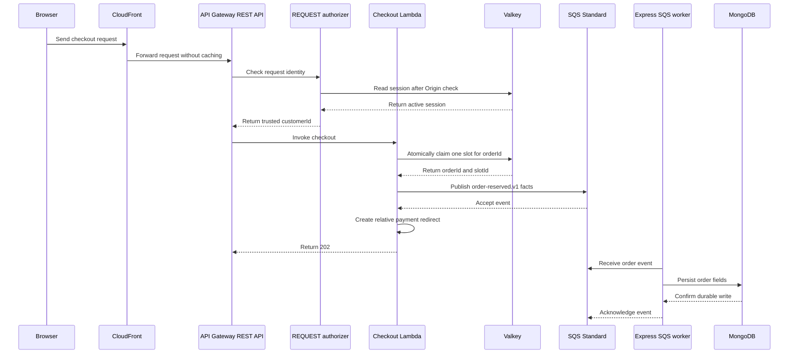

# System design

## Purpose

This document is the short entry point for the flash-sale design. It shows the master flow and links to each design facet.

## Flow

The browser sends the purchase request directly to the configured CloudFront checkout endpoint. CloudFront routes it through API Gateway to the checkout Lambda. Express does not invoke Lambda or proxy the request.

The API Gateway authorizer checks the Better Auth session in Valkey. MongoDB stores users, credentials, and business data. The authorizer does not call Express or MongoDB.

The checkout Lambda reads trusted `customerId` from API Gateway authorizer context. It atomically claims a slot in Valkey and sends `order-reserved.v1` with `orderId`, `customerId`, `listingId`, and `slotId` through SQS. After SQS accepts the event, the payment feature validates `orderId` and returns a relative `/payment?orderId=<encoded id>` redirect. Lambda includes this URL in its HTTP 202 response. SQS is the only Lambda-to-Express bridge. The Express worker persists the order before the mock payment page uses `orderId`.

The client creates the idempotency key. Valkey maps `(listingId, trusted customerId, client idempotencyKey)` to `orderId` and `slotId`. MongoDB does not store the client key. A duplicate SQS event upserts by unique `orderId`.

The order model stores `orderId`, `customerId`, `listingId`, `slotId`, `status`, and timestamps. `orderId` is the checkout-attempt and slot-owner identifier. The backend payment feature applies local or test outcomes. Provider callbacks and unified reconciliation remain planned work.

The listing document stores identity, display name, sale window, and `reserveSlots`. The initial slot count is an operation parameter. MongoDB derives total stock from slot documents and derives public stock by subtracting `reserveSlots`. Valkey holds the live availability pool.

The design has no durable replay for a Lambda crash after the Valkey pop and before SQS accepts the event.

Increment 4 implements the REST Lambda handler, tuple-scoped Valkey claim, and SQS publisher. LocalStack and deployment checks remain pending.

## Facets

- [Listing and inventory](listing-and-inventory.md): listing setup, slot counts, inventory ownership, and the future DynamoDB alternative.
- [Checkout](checkout.md): deployed request path, idempotency, and the Valkey-to-SQS gap.
- [Orders](orders.md): durable order fields, ownership indexes, and statuses.
- [Payments](payments.md): payment redirect, mock outcome feature, and deferred provider work.
- [Identity and access](identity-and-access.md): trust boundaries and the selected REST REQUEST authorizer.
- [Reliability](reliability.md): failure behavior, recovery limits, and architecture trade-offs.
- [Testing strategy](testing-strategy.md): current test evidence and planned test layers.
- [Implementation roadmap](implementation-roadmap.md): increments, choices, and verification plans.

## Change log

### 2026-09-23

- Recorded the minimal order model and SQS event shape.
- Defined listing counts from slot documents and retained Valkey as the live inventory authority.

### 2026-09-24

- Recorded the checkout handler response after SQS accepts the reservation event.
- Added the relative payment redirect to the successful checkout response.
