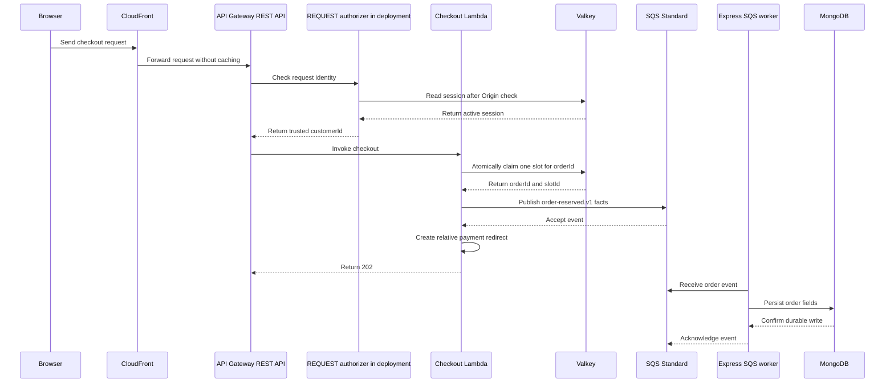

# System design

## Purpose

This document is the short entry point for the flash-sale design. It shows the master flow and links to each design facet.

## Flow

The browser sends the purchase request directly to the configured CloudFront checkout endpoint. CloudFront routes it through API Gateway to the checkout Lambda. Express does not invoke Lambda or proxy the request.

The local test stack uses Caddy as its only browser-facing host at `http://bookipi.localhost:3200`. Caddy serves the Node storefront, sends other `/api/*` requests to the Express container, and routes exact `/api/checkout` requests to the LocalStack API Gateway REST API. LocalStack uses the deterministic API ID `bookipi-checkout` and its execute-api hostname. Caddy replaces CloudFront only for local tests. It does not model CloudFront behavior.

In deployment, the API Gateway REQUEST authorizer checks the Better Auth session in Valkey. The local Hobby template uses a combined checkout Lambda adapter because the isolated LocalStack `2026.8.4` Hobby prototype did not invoke or enforce the configured REQUEST authorizer. The local adapter checks Origin and the Better Auth session, then calls `startCheckout` directly with the verified customer ID. It does not build authorizer context or call `handler.ts`. MongoDB stores users, credentials, and business data. Neither checkout path calls Express or MongoDB.

The checkout Lambda reads trusted `customerId` from API Gateway authorizer context. It atomically claims a slot in Valkey and sends `order-reserved.v1` with `orderId`, `customerId`, `listingId`, and `slotId` through SQS. After SQS accepts the event, the payment feature validates `orderId` and returns a relative `/payment?orderId=<encoded id>` redirect. Lambda includes this URL in its HTTP 202 response. SQS is the only Lambda-to-Express bridge. The Express worker persists the order before the mock payment page uses `orderId`.

The client creates the idempotency key. Valkey maps `(listingId, trusted customerId, client idempotencyKey)` to `orderId` and `slotId`. MongoDB does not store the client key. A duplicate SQS event upserts by unique `orderId`.

The order model stores `orderId`, `customerId`, `listingId`, `slotId`, `status`, optional `releaseStatus`, and timestamps. `orderId` is the checkout-attempt and slot-owner identifier. The backend payment feature applies mock outcomes when its order routes are configured. Cancellation stores a pending release intent atomically with `CANCELLED`. The order feature reconciles it after each reservation upsert or payment outcome. A process stop after cancellation has no background sweep; SQS retries an unacknowledged trigger, and the payment caller retries a failed or interrupted request. Provider callback correlation and payment reconciliation remain planned work.

The listing document stores identity, display name, sale window, and `reserveSlots`. The initial slot count is an operation parameter. MongoDB derives total stock from slot documents and derives public stock by subtracting `reserveSlots`. Valkey holds the live availability pool.

The storefront reads public listing metadata and counts from `GET /api/listings/{listingId}`. This read does not expose slot IDs. It keeps `publicStock = stockTotal - reserveSlots`, counts `boughtUnits` from `COMPLETE` orders, and derives `remainingUnits = max(0, publicStock - PENDING orders - COMPLETE orders)`. These MongoDB counts do not show the live Valkey pool. Checkout errors from the Valkey claim determine sold-out state.

The home page reads `GET /api/orders/current?listingId=...` for the signed-in customer. This route returns only that customer's `PENDING` or `COMPLETE` order. It shows the order ID and status, links pending orders to `/payment`, and links completed orders to `/order-status`. After a successful mock outcome, `/payment` opens `/order-status?orderId=...`, which reads the authenticated order again.

The design has no durable replay for a Lambda crash after the Valkey pop and before SQS accepts the event.

Increment 8 implements the public listing read, direct credentialed storefront checkout, the origin-first REST REQUEST authorizer, and no-store checkout responses with conditional exact-origin CORS. Local integration checks cover the Caddy route, LocalStack API Gateway, combined local adapter, Lambda, SQS, MongoDB persistence, and owner payment flow. The [isolated REQUEST-authorizer prototype](../infra/localstack/prototypes/rest-request-authorizer/) records that LocalStack `2026.8.4` Hobby did not invoke or enforce that authorizer. The combined adapter is a local workaround, not the production architecture and not evidence about AWS behavior. Deployment must still verify CloudFront cookie and Origin forwarding, checkout caching, REQUEST-authorizer invocation and result caching, and the unauthenticated preflight method.

## Facets

- [Listing and inventory](listing-and-inventory.md): listing setup, slot counts, inventory ownership, and the future DynamoDB alternative.
- [Checkout](checkout.md): deployed request path, idempotency, and the Valkey-to-SQS gap.
- [Orders](orders.md): durable order fields, ownership indexes, and statuses.
- [Payments](payments.md): payment redirect, mock outcome feature, and deferred provider work.
- [Identity and access](identity-and-access.md): trust boundaries and the selected REST REQUEST authorizer.
- [Reliability](reliability.md): failure behavior, recovery limits, and architecture trade-offs.
- [Testing strategy](testing-strategy.md): current test evidence and planned test layers.
- [Implementation roadmap](implementation-roadmap.md): increments, choices, and verification plans.

## Change log

### 2026-09-23

- Recorded the minimal order model and SQS event shape.
- Defined listing counts from slot documents and retained Valkey as the live inventory authority.

### 2026-09-24

- Recorded the checkout handler response after SQS accepts the reservation event.
- Added the relative payment redirect to the successful checkout response.
